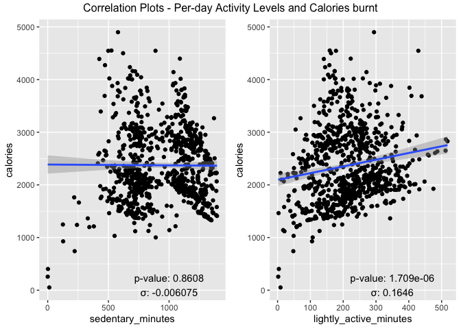
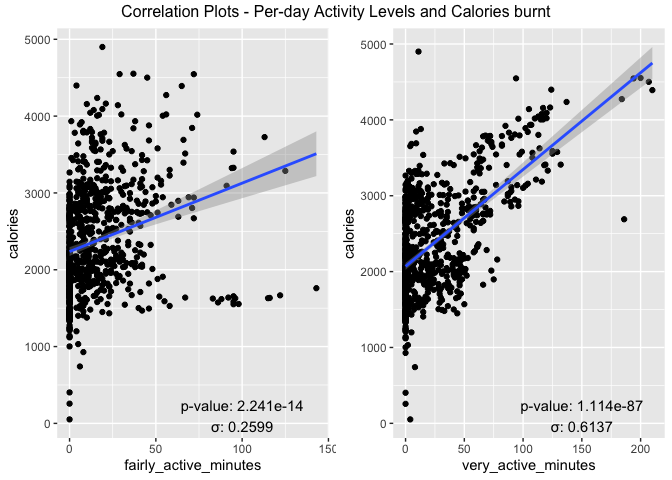
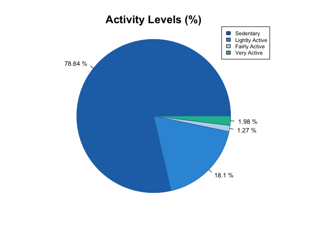
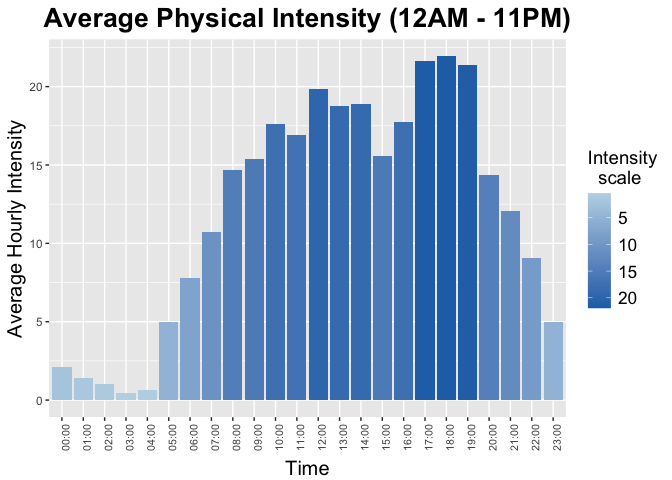
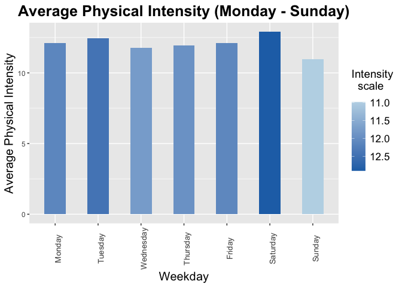
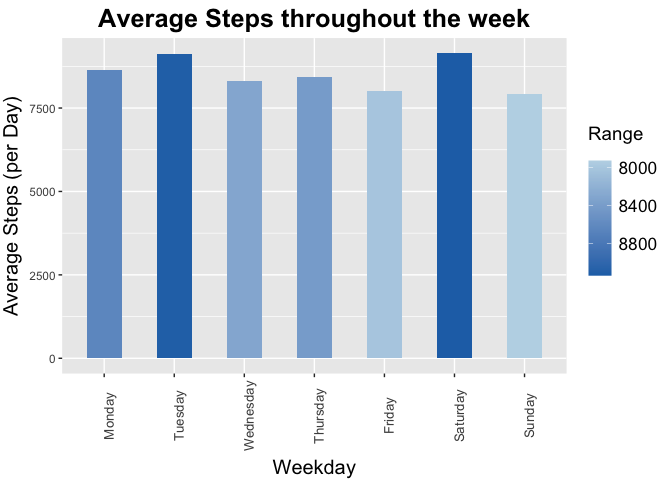
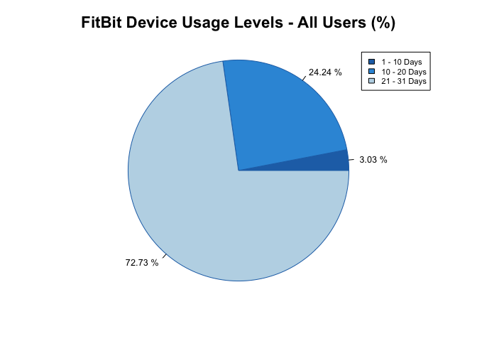
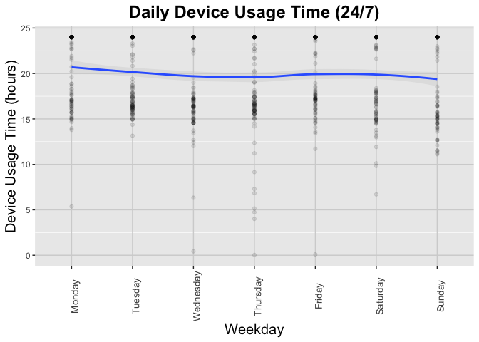
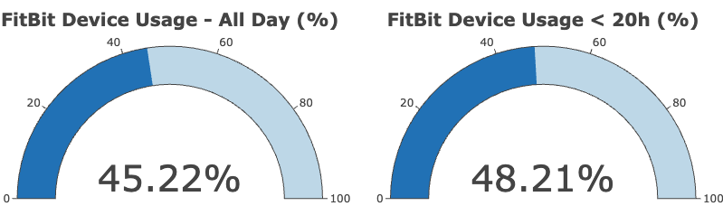
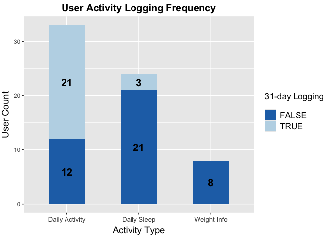

How Can a Wellness Technology Company Play It Smart? - Bellabeat Case Study
================
Aishwarya Ramamurthy (Last Updated: 4 July 2024)

- [Overview](#overview)
- [Bellabeat: A Fem-Tech Pioneer](#bellabeat-a-fem-tech-pioneer)
  - [About the company](#about-the-company)
  - [Products](#products)
- [Stage 1: Ask](#stage-1-ask)
  - [1.1 Business Task](#11-business-task)
  - [1.2 Key Stakeholders](#12-key-stakeholders)
- [Stage 2: Prepare](#stage-2-prepare)
  - [2.1 Dataset - Storage and
    Organization](#21-dataset---storage-and-organization)
  - [2.2 Data Credibility](#22-data-credibility)
  - [2.3 Data Privacy, Accessibility and
    Licensing](#23-data-privacy-accessibility-and-licensing)
  - [2.4 Limitations](#24-limitations)
- [Stage 3: Process](#stage-3-process)
  - [3.1 Dataset Exploration](#31-dataset-exploration)
  - [3.2 Data Cleaning](#32-data-cleaning)
- [Stage 4: Analyze and Share](#stage-4-analyze-and-share)
- [Stage 5: Act](#stage-5-act)
  - [5.1 Recommendations](#recommendations)
- [Conclusion](#conclusion)

# Overview

This is a case study completed and presented as part of the [Google Data
Analytics Professional Certificate
Course](https://www.coursera.org/professional-certificates/google-data-analytics?%5D)
using R programming (RStudio IDE) involving 6 stages of Data Analysis -
**Ask, Prepare, Process, Analyze, Share** and **Act**. Also a Capstone
Project, it focuses on analyzing smart devices’ fitness data and help
improve the marketing strategy for products manufactured by an exclusive
wellness brand for women, Bellabeat.

# Bellabeat: A Fem-Tech Pioneer

## About the company

Founded in 2013, Bellabeat is a women’s wellness brand having a
portfolio of innovative health-focused products designed to shape the
health and well-being of women. Credited a female-technology (fem-tech)
pioneer with continued efforts to widen their footprint in the global
smart device market, Urška Sršen (cofounder and Chief Creative Officer
of Bellabeat) believes in a smart device’s fitness data analysis, whose
insights could boost the company’s economical (market) growth with
improved product features/specifications.

## Products

- **Bellabeat app:** The Bellabeat app (synced with the smart devices)
  provides users with health data related to their activity, menstrual
  cycle, sleep, stress and mindfulness habits. which would potentially
  help them better understand their current habits and make
  health-informed decisions.

- **Bellabeat membership:** Users are offered a Bellabeat
  subscription-based membership program giving them 24/7 access to a
  completely personalized guidance on nutrition, activity, sleep, health
  and beauty, and mindfulness based on their lifestyle and goals.

- **Leaf:** This classic wellness tracker can be worn as a bracelet,
  clip or a necklace and connects to the Bellabeat app to track
  activity, sleep, and stress.

- **Spring:** A smart water bottle (in sync with the app) that tracks
  daily water intake to ensure appropriate hydration throughout the day.

- **Time:** This wellness watch integrates the timeless look of a
  classic timepiece with smart technology to track user activity, sleep,
  and stress. When connected to the Bellabeat app, it provides the users
  with insights into their daily wellness.

# Stage 1: Ask

The following analysis is guided by answering key questions pertinent to
those noticeable trends in the smart device usage, that can further be
extended and applied to Bellabeat customers and help influence the
company’s marketing strategy.

## 1.1 Business Task

To analyze a non-Bellabeat smart device (FitBit) data to derive/gain
insights into how consumers use their smart devices and provide
high-level recommendations to help guide marketing strategy for one of
Bellabeat’s products - the classic wearable wellness tracker, Leaf.

## 1.2 Key Stakeholders

- **Urška Sršen:** Co-founder and Cheif Creative Officer, Bellabeat.
- **Sando Mur:** Mathematician and Bellabeat’s co-founder; key member of
  the Bellabeat executive team.
- **Bellabeat Marketing Analytics Team:** A team od data analysts
  responsible for data collection, analysis and reporting thereby
  helping guide Bellabeat’s marketing strategy.

# Stage 2: Prepare

## 2.1 Dataset - Storage and Organization

To explore and gain insights into a smart device users’ daily habits,
the publicly available [FitBit Fitness Tracker
Data](https://www.kaggle.com/datasets/arashnic/fitbit) (through Kaggle)
is used. This dataset is curated with responses of thirty FitBit users
through a survey conducted via Amazon Mechanical Turk spanning two
months - 03.12.2016 - 05.12.2016. These 30 eligible FitBit users
consented to the submission of their personal tracker data, including
seconds-level heart rate data, minute-level, hour-level and day-level
output for physical activity (calories, intensities, steps) and sleep
monitoring. The downloaded dataset (onto local machine) consists of 18
CSV (comma-separated values) files in both long (narrow - 15 files) and wide (3 files)
formats. An initial glimpse through the dataset suggests certain
discrepancies and data unavailability, whose details are presented in
the \*\*Process\* stage.

## 2.2 Data Credibility

A dataset is considered credible if it adheres to the ROCCC
(Reliability, Original, Comprehensive, Current, Cited) approach.
Following is a ROCCC analysis of the FitBit Tracker dataset:

- **Reliability:** The dataset can be attributed accurate as the
  underlying data is an outcome from a well-known fitness device
  tracker. Despite the survey being conducted over 2 months, the
  availability of data spanning only a month (April 12, 2016 - May
  12, 2016) with a small sample size of 30 users (in accordance with the
  [Central Limit
  Theorem](https://en.wikipedia.org/wiki/Central_limit_theorem)), yet
  inconsistent across various metrics in the dataset, can result in
  biased (skewed) results/distribution. Having over 128 million
  registered users, data sourced directly from the FitBit forum could
  boost the reliability and hence, the credibility of the dataset,
  resulting in more comprehensive insights and data-driven decisions.
  **(Level: Low)**
- **Original:** As the original data source is unknown, this dataset
  consisting of third-party survey data) can possibly not be validated
  for its originality and reliability. **(Level: Low)**
- **Comprehensive:** Although this dataset comprises details about
  physical activity, sleep monitoring and heart rate at various
  timestamp levels (minute/hour/seconds/day), a small sample size (30)
  spanning 2 months and unavailability of details pertinent to women’s
  health seem to not make it a highly comprehensive dataset with all
  critical information to answer key questions. **(Level: Medium)**
- **Current:** As the dataset dates back to 2016, the trends observed
  and insights gained may not be highly relevant to the current times
  witnessing drastic technological developments. **(Level: Low)**
- **Cited:** The Kaggle dataset (made available through Möbius) cites
  and redirects the user to its source publisher Zenodo.org, but does
  not mention the creator of the dataset nor its source organization.
  The only detail provided about this being a survey conducted by a
  third-party company (Amazon Mechanical Turk) proves insufficient for
  it to be considered a highly cited and a trustworthy dataset.
  **(Level: Medium)**

## 2.3 Data Privacy, Accessibility and Licensing

The thirty eligible FitBit users who consented to share their personal
wellness tracker details have been assigned IDs in place of their
original names thereby ensuring confidentiality. Further, this dataset
is available to download on the Kaggle platform (made available by
Möbius) under the CC0: Public Domain Creative Commons License, thus
eliminating the need for further licensing or copyright permissions
required from the owner).

## 2.4 Limitations

- Key demographics and statistical data about the surveyed users such as
  age, gender have not been recorded, which can add more relevance to
  the analysis and the insights gained.

- Inconsistent data logging across metrics such as weight, heartrate,
  sleep monitoring and unavailability of physical activity data for the
  month of March 2016 highly impacts its credibility. Such discrepancies
  in this dataset does not account for data integrity (accuracy,
  consistency and reliability over time) in addition to the reasons
  cited above.

# Stage 3: Process

The processing stage involves data exploration and cleaning, thus making
it free of errors and outliers (ensuring data integrity). This includes
removing duplicate values, dropping missing (NA) values, renaming
columns/variables and formatting their datatypes (as per conventions)
for clarity, and merging datasets (for further analysis). RStudio IDE
for R programming is used to process (clean), analyze and visualize the
FitBit Tracker dataset.

## 3.1 Dataset Exploration

**Installing and Loading R Packages**

``` r
#Make sure to set the working directory for your R program using setwd("FilePath") 
#Example: setwd("~/Desktop/FitbitTrackerData/mturkfitbit_export_4.12.16-5.12.16/FitabaseData-4.12.16-5.12.16/dailyActivity_merged.csv)

# Install the required R packages 
# install.packages(c("tidyverse","lubridate","janitor","dplyr","tidyr","readr","ggplot2","skimr","gridExtra","ggpmisc","RColorBrewer","plotly","shiny")) 

#Use lapply() to load all packages at once; use "require" or "library" argument after specifying the list of packages using lapply(c()).

lapply(c("tidyverse","lubridate","janitor","dplyr","tidyr","readr","ggplot2","skimr","gridExtra","ggpmisc",
         "RColorBrewer","plotly","shiny"),require,character.only=TRUE)
```

    ## Loading required package: tidyverse

    ## ── Attaching core tidyverse packages ──────────────────────── tidyverse 2.0.0 ──
    ## ✔ dplyr     1.1.4     ✔ readr     2.1.5
    ## ✔ forcats   1.0.0     ✔ stringr   1.5.1
    ## ✔ ggplot2   3.5.1     ✔ tibble    3.2.1
    ## ✔ lubridate 1.9.3     ✔ tidyr     1.3.1
    ## ✔ purrr     1.0.2     
    ## ── Conflicts ────────────────────────────────────────── tidyverse_conflicts() ──
    ## ✖ dplyr::filter() masks stats::filter()
    ## ✖ dplyr::lag()    masks stats::lag()
    ## ℹ Use the conflicted package (<http://conflicted.r-lib.org/>) to force all conflicts to become errors
    ## Loading required package: janitor
    ## 
    ## 
    ## Attaching package: 'janitor'
    ## 
    ## 
    ## The following objects are masked from 'package:stats':
    ## 
    ##     chisq.test, fisher.test
    ## 
    ## 
    ## Loading required package: skimr
    ## 
    ## Loading required package: gridExtra
    ## 
    ## 
    ## Attaching package: 'gridExtra'
    ## 
    ## 
    ## The following object is masked from 'package:dplyr':
    ## 
    ##     combine
    ## 
    ## 
    ## Loading required package: ggpmisc
    ## 
    ## Loading required package: ggpp
    ## 
    ## Registered S3 methods overwritten by 'ggpp':
    ##   method                  from   
    ##   heightDetails.titleGrob ggplot2
    ##   widthDetails.titleGrob  ggplot2
    ## 
    ## 
    ## Attaching package: 'ggpp'
    ## 
    ## 
    ## The following object is masked from 'package:ggplot2':
    ## 
    ##     annotate
    ## 
    ## 
    ## Loading required package: RColorBrewer
    ## 
    ## Loading required package: plotly
    ## 
    ## 
    ## Attaching package: 'plotly'
    ## 
    ## 
    ## The following object is masked from 'package:ggplot2':
    ## 
    ##     last_plot
    ## 
    ## 
    ## The following object is masked from 'package:stats':
    ## 
    ##     filter
    ## 
    ## 
    ## The following object is masked from 'package:graphics':
    ## 
    ##     layout
    ## 
    ## 
    ## Loading required package: shiny

    ## [[1]]
    ## [1] TRUE
    ## 
    ## [[2]]
    ## [1] TRUE
    ## 
    ## [[3]]
    ## [1] TRUE
    ## 
    ## [[4]]
    ## [1] TRUE
    ## 
    ## [[5]]
    ## [1] TRUE
    ## 
    ## [[6]]
    ## [1] TRUE
    ## 
    ## [[7]]
    ## [1] TRUE
    ## 
    ## [[8]]
    ## [1] TRUE
    ## 
    ## [[9]]
    ## [1] TRUE
    ## 
    ## [[10]]
    ## [1] TRUE
    ## 
    ## [[11]]
    ## [1] TRUE
    ## 
    ## [[12]]
    ## [1] TRUE
    ## 
    ## [[13]]
    ## [1] TRUE

**Importing Datasets**

``` r
#Although the survey was carried out between March 13, 2016 to May 12,2016, participants' data exists only from April 12,2016 to May 12,2016 (31 days).So, we consider only the latter dataset.

daily_activity <- read_csv("FitbitTrackerData/mturkfitbit_export_4.12.16-5.12.16/FitabaseData-4.12.16-5.12.16/dailyActivity_merged.csv")
```

    ## Rows: 940 Columns: 15
    ## ── Column specification ────────────────────────────────────────────────────────
    ## Delimiter: ","
    ## chr  (1): ActivityDate
    ## dbl (14): Id, TotalSteps, TotalDistance, TrackerDistance, LoggedActivitiesDi...
    ## 
    ## ℹ Use `spec()` to retrieve the full column specification for this data.
    ## ℹ Specify the column types or set `show_col_types = FALSE` to quiet this message.

``` r
daily_calories <- read_csv("FitbitTrackerData/mturkfitbit_export_4.12.16-5.12.16/FitabaseData-4.12.16-5.12.16/dailyCalories_merged.csv")
```

    ## Rows: 940 Columns: 3
    ## ── Column specification ────────────────────────────────────────────────────────
    ## Delimiter: ","
    ## chr (1): ActivityDay
    ## dbl (2): Id, Calories
    ## 
    ## ℹ Use `spec()` to retrieve the full column specification for this data.
    ## ℹ Specify the column types or set `show_col_types = FALSE` to quiet this message.

``` r
daily_intensities <- read_csv("FitbitTrackerData/mturkfitbit_export_4.12.16-5.12.16/FitabaseData-4.12.16-5.12.16/dailyIntensities_merged.csv")
```

    ## Rows: 940 Columns: 10
    ## ── Column specification ────────────────────────────────────────────────────────
    ## Delimiter: ","
    ## chr (1): ActivityDay
    ## dbl (9): Id, SedentaryMinutes, LightlyActiveMinutes, FairlyActiveMinutes, Ve...
    ## 
    ## ℹ Use `spec()` to retrieve the full column specification for this data.
    ## ℹ Specify the column types or set `show_col_types = FALSE` to quiet this message.

``` r
daily_steps <- read_csv("FitbitTrackerData/mturkfitbit_export_4.12.16-5.12.16/FitabaseData-4.12.16-5.12.16/dailySteps_merged.csv")
```

    ## Rows: 940 Columns: 3
    ## ── Column specification ────────────────────────────────────────────────────────
    ## Delimiter: ","
    ## chr (1): ActivityDay
    ## dbl (2): Id, StepTotal
    ## 
    ## ℹ Use `spec()` to retrieve the full column specification for this data.
    ## ℹ Specify the column types or set `show_col_types = FALSE` to quiet this message.

``` r
daily_sleep <- read_csv("FitbitTrackerData/mturkfitbit_export_4.12.16-5.12.16/FitabaseData-4.12.16-5.12.16/sleepDay_merged.csv")
```

    ## Rows: 413 Columns: 5
    ## ── Column specification ────────────────────────────────────────────────────────
    ## Delimiter: ","
    ## chr (1): SleepDay
    ## dbl (4): Id, TotalSleepRecords, TotalMinutesAsleep, TotalTimeInBed
    ## 
    ## ℹ Use `spec()` to retrieve the full column specification for this data.
    ## ℹ Specify the column types or set `show_col_types = FALSE` to quiet this message.

``` r
heartrate_seconds <- read_csv("FitbitTrackerData/mturkfitbit_export_4.12.16-5.12.16/FitabaseData-4.12.16-5.12.16/heartrate_seconds_merged.csv")
```

    ## Rows: 2483658 Columns: 3
    ## ── Column specification ────────────────────────────────────────────────────────
    ## Delimiter: ","
    ## chr (1): Time
    ## dbl (2): Id, Value
    ## 
    ## ℹ Use `spec()` to retrieve the full column specification for this data.
    ## ℹ Specify the column types or set `show_col_types = FALSE` to quiet this message.

``` r
hourly_calories <- read_csv("FitbitTrackerData/mturkfitbit_export_4.12.16-5.12.16/FitabaseData-4.12.16-5.12.16/hourlyCalories_merged.csv")
```

    ## Rows: 22099 Columns: 3
    ## ── Column specification ────────────────────────────────────────────────────────
    ## Delimiter: ","
    ## chr (1): ActivityHour
    ## dbl (2): Id, Calories
    ## 
    ## ℹ Use `spec()` to retrieve the full column specification for this data.
    ## ℹ Specify the column types or set `show_col_types = FALSE` to quiet this message.

``` r
hourly_intensities <- read_csv("FitbitTrackerData/mturkfitbit_export_4.12.16-5.12.16/FitabaseData-4.12.16-5.12.16/hourlyIntensities_merged.csv")
```

    ## Rows: 22099 Columns: 4
    ## ── Column specification ────────────────────────────────────────────────────────
    ## Delimiter: ","
    ## chr (1): ActivityHour
    ## dbl (3): Id, TotalIntensity, AverageIntensity
    ## 
    ## ℹ Use `spec()` to retrieve the full column specification for this data.
    ## ℹ Specify the column types or set `show_col_types = FALSE` to quiet this message.

``` r
hourly_steps <- read_csv("FitbitTrackerData/mturkfitbit_export_4.12.16-5.12.16/FitabaseData-4.12.16-5.12.16/hourlySteps_merged.csv")
```

    ## Rows: 22099 Columns: 3
    ## ── Column specification ────────────────────────────────────────────────────────
    ## Delimiter: ","
    ## chr (1): ActivityHour
    ## dbl (2): Id, StepTotal
    ## 
    ## ℹ Use `spec()` to retrieve the full column specification for this data.
    ## ℹ Specify the column types or set `show_col_types = FALSE` to quiet this message.

``` r
minute_calories_narrow <- read_csv("FitbitTrackerData/mturkfitbit_export_4.12.16-5.12.16/FitabaseData-4.12.16-5.12.16/minuteCaloriesNarrow_merged.csv")
```

    ## Rows: 1325580 Columns: 3
    ## ── Column specification ────────────────────────────────────────────────────────
    ## Delimiter: ","
    ## chr (1): ActivityMinute
    ## dbl (2): Id, Calories
    ## 
    ## ℹ Use `spec()` to retrieve the full column specification for this data.
    ## ℹ Specify the column types or set `show_col_types = FALSE` to quiet this message.

``` r
minute_calories_wide <- read_csv("FitbitTrackerData/mturkfitbit_export_4.12.16-5.12.16/FitabaseData-4.12.16-5.12.16/minuteCaloriesWide_merged.csv")
```

    ## Rows: 21645 Columns: 62
    ## ── Column specification ────────────────────────────────────────────────────────
    ## Delimiter: ","
    ## chr  (1): ActivityHour
    ## dbl (61): Id, Calories00, Calories01, Calories02, Calories03, Calories04, Ca...
    ## 
    ## ℹ Use `spec()` to retrieve the full column specification for this data.
    ## ℹ Specify the column types or set `show_col_types = FALSE` to quiet this message.

``` r
minute_intensities_narrow <- read_csv("FitbitTrackerData/mturkfitbit_export_4.12.16-5.12.16/FitabaseData-4.12.16-5.12.16/minuteIntensitiesNarrow_merged.csv")
```

    ## Rows: 1325580 Columns: 3
    ## ── Column specification ────────────────────────────────────────────────────────
    ## Delimiter: ","
    ## chr (1): ActivityMinute
    ## dbl (2): Id, Intensity
    ## 
    ## ℹ Use `spec()` to retrieve the full column specification for this data.
    ## ℹ Specify the column types or set `show_col_types = FALSE` to quiet this message.

``` r
minute_intensities_wide <- read_csv("FitbitTrackerData/mturkfitbit_export_4.12.16-5.12.16/FitabaseData-4.12.16-5.12.16/minuteIntensitiesWide_merged.csv")
```

    ## Rows: 21645 Columns: 62
    ## ── Column specification ────────────────────────────────────────────────────────
    ## Delimiter: ","
    ## chr  (1): ActivityHour
    ## dbl (61): Id, Intensity00, Intensity01, Intensity02, Intensity03, Intensity0...
    ## 
    ## ℹ Use `spec()` to retrieve the full column specification for this data.
    ## ℹ Specify the column types or set `show_col_types = FALSE` to quiet this message.

``` r
minute_METs_narrow <- read_csv("FitbitTrackerData/mturkfitbit_export_4.12.16-5.12.16/FitabaseData-4.12.16-5.12.16/minuteMETsNarrow_merged.csv")
```

    ## Rows: 1325580 Columns: 3
    ## ── Column specification ────────────────────────────────────────────────────────
    ## Delimiter: ","
    ## chr (1): ActivityMinute
    ## dbl (2): Id, METs
    ## 
    ## ℹ Use `spec()` to retrieve the full column specification for this data.
    ## ℹ Specify the column types or set `show_col_types = FALSE` to quiet this message.

``` r
minute_sleep <- read_csv("FitbitTrackerData/mturkfitbit_export_4.12.16-5.12.16/FitabaseData-4.12.16-5.12.16/minuteSleep_merged.csv")
```

    ## Rows: 188521 Columns: 4
    ## ── Column specification ────────────────────────────────────────────────────────
    ## Delimiter: ","
    ## chr (1): date
    ## dbl (3): Id, value, logId
    ## 
    ## ℹ Use `spec()` to retrieve the full column specification for this data.
    ## ℹ Specify the column types or set `show_col_types = FALSE` to quiet this message.

``` r
minute_steps_narrow <- read_csv("FitbitTrackerData/mturkfitbit_export_4.12.16-5.12.16/FitabaseData-4.12.16-5.12.16/minuteStepsNarrow_merged.csv")
```

    ## Rows: 1325580 Columns: 3
    ## ── Column specification ────────────────────────────────────────────────────────
    ## Delimiter: ","
    ## chr (1): ActivityMinute
    ## dbl (2): Id, Steps
    ## 
    ## ℹ Use `spec()` to retrieve the full column specification for this data.
    ## ℹ Specify the column types or set `show_col_types = FALSE` to quiet this message.

``` r
minute_steps_wide <- read_csv("FitbitTrackerData/mturkfitbit_export_4.12.16-5.12.16/FitabaseData-4.12.16-5.12.16/minuteStepsWide_merged.csv")
```

    ## Rows: 21645 Columns: 62
    ## ── Column specification ────────────────────────────────────────────────────────
    ## Delimiter: ","
    ## chr  (1): ActivityHour
    ## dbl (61): Id, Steps00, Steps01, Steps02, Steps03, Steps04, Steps05, Steps06,...
    ## 
    ## ℹ Use `spec()` to retrieve the full column specification for this data.
    ## ℹ Specify the column types or set `show_col_types = FALSE` to quiet this message.

``` r
weight_log_info <- read_csv("FitbitTrackerData/mturkfitbit_export_4.12.16-5.12.16/FitabaseData-4.12.16-5.12.16/weightLogInfo_merged.csv")
```

    ## Rows: 67 Columns: 8
    ## ── Column specification ────────────────────────────────────────────────────────
    ## Delimiter: ","
    ## chr (1): Date
    ## dbl (6): Id, WeightKg, WeightPounds, Fat, BMI, LogId
    ## lgl (1): IsManualReport
    ## 
    ## ℹ Use `spec()` to retrieve the full column specification for this data.
    ## ℹ Specify the column types or set `show_col_types = FALSE` to quiet this message.

``` r
#Temporal division of datasets - Seconds, Minute-wise, Hourly and Daily dataframes.
#Glimpse of datasets

fitbit_df <- list("heartrate_seconds"=heartrate_seconds,"minute_calories"=minute_calories_narrow,
                  "minute_intensities"=minute_intensities_narrow,"minute_METs"=minute_METs_narrow,"minute_sleep"=minute_sleep,
                  "minute_steps"=minute_steps_narrow,"hourly_calories"=hourly_calories,"hourly_intensities"=hourly_intensities,
                  "hourly_steps"=hourly_steps,"daily_activity"=daily_activity,"daily_calories"=daily_calories,
                  "daily_intensities"=daily_intensities,"daily_steps"=daily_steps,"daily_sleep"=daily_sleep,"weight_log_info"=weight_log_info)
                  
#walk(fitbit_df,glimpse)
lapply(fitbit_df, head,n=3) 
```

    ## $heartrate_seconds
    ## # A tibble: 3 × 3
    ##           Id Time                 Value
    ##        <dbl> <chr>                <dbl>
    ## 1 2022484408 4/12/2016 7:21:00 AM    97
    ## 2 2022484408 4/12/2016 7:21:05 AM   102
    ## 3 2022484408 4/12/2016 7:21:10 AM   105
    ## 
    ## $minute_calories
    ## # A tibble: 3 × 3
    ##           Id ActivityMinute        Calories
    ##        <dbl> <chr>                    <dbl>
    ## 1 1503960366 4/12/2016 12:00:00 AM    0.786
    ## 2 1503960366 4/12/2016 12:01:00 AM    0.786
    ## 3 1503960366 4/12/2016 12:02:00 AM    0.786
    ## 
    ## $minute_intensities
    ## # A tibble: 3 × 3
    ##           Id ActivityMinute        Intensity
    ##        <dbl> <chr>                     <dbl>
    ## 1 1503960366 4/12/2016 12:00:00 AM         0
    ## 2 1503960366 4/12/2016 12:01:00 AM         0
    ## 3 1503960366 4/12/2016 12:02:00 AM         0
    ## 
    ## $minute_METs
    ## # A tibble: 3 × 3
    ##           Id ActivityMinute         METs
    ##        <dbl> <chr>                 <dbl>
    ## 1 1503960366 4/12/2016 12:00:00 AM    10
    ## 2 1503960366 4/12/2016 12:01:00 AM    10
    ## 3 1503960366 4/12/2016 12:02:00 AM    10
    ## 
    ## $minute_sleep
    ## # A tibble: 3 × 4
    ##           Id date                 value       logId
    ##        <dbl> <chr>                <dbl>       <dbl>
    ## 1 1503960366 4/12/2016 2:47:30 AM     3 11380564589
    ## 2 1503960366 4/12/2016 2:48:30 AM     2 11380564589
    ## 3 1503960366 4/12/2016 2:49:30 AM     1 11380564589
    ## 
    ## $minute_steps
    ## # A tibble: 3 × 3
    ##           Id ActivityMinute        Steps
    ##        <dbl> <chr>                 <dbl>
    ## 1 1503960366 4/12/2016 12:00:00 AM     0
    ## 2 1503960366 4/12/2016 12:01:00 AM     0
    ## 3 1503960366 4/12/2016 12:02:00 AM     0
    ## 
    ## $hourly_calories
    ## # A tibble: 3 × 3
    ##           Id ActivityHour          Calories
    ##        <dbl> <chr>                    <dbl>
    ## 1 1503960366 4/12/2016 12:00:00 AM       81
    ## 2 1503960366 4/12/2016 1:00:00 AM        61
    ## 3 1503960366 4/12/2016 2:00:00 AM        59
    ## 
    ## $hourly_intensities
    ## # A tibble: 3 × 4
    ##           Id ActivityHour          TotalIntensity AverageIntensity
    ##        <dbl> <chr>                          <dbl>            <dbl>
    ## 1 1503960366 4/12/2016 12:00:00 AM             20            0.333
    ## 2 1503960366 4/12/2016 1:00:00 AM               8            0.133
    ## 3 1503960366 4/12/2016 2:00:00 AM               7            0.117
    ## 
    ## $hourly_steps
    ## # A tibble: 3 × 3
    ##           Id ActivityHour          StepTotal
    ##        <dbl> <chr>                     <dbl>
    ## 1 1503960366 4/12/2016 12:00:00 AM       373
    ## 2 1503960366 4/12/2016 1:00:00 AM        160
    ## 3 1503960366 4/12/2016 2:00:00 AM        151
    ## 
    ## $daily_activity
    ## # A tibble: 3 × 15
    ##           Id ActivityDate TotalSteps TotalDistance TrackerDistance
    ##        <dbl> <chr>             <dbl>         <dbl>           <dbl>
    ## 1 1503960366 4/12/2016         13162          8.5             8.5 
    ## 2 1503960366 4/13/2016         10735          6.97            6.97
    ## 3 1503960366 4/14/2016         10460          6.74            6.74
    ## # ℹ 10 more variables: LoggedActivitiesDistance <dbl>,
    ## #   VeryActiveDistance <dbl>, ModeratelyActiveDistance <dbl>,
    ## #   LightActiveDistance <dbl>, SedentaryActiveDistance <dbl>,
    ## #   VeryActiveMinutes <dbl>, FairlyActiveMinutes <dbl>,
    ## #   LightlyActiveMinutes <dbl>, SedentaryMinutes <dbl>, Calories <dbl>
    ## 
    ## $daily_calories
    ## # A tibble: 3 × 3
    ##           Id ActivityDay Calories
    ##        <dbl> <chr>          <dbl>
    ## 1 1503960366 4/12/2016       1985
    ## 2 1503960366 4/13/2016       1797
    ## 3 1503960366 4/14/2016       1776
    ## 
    ## $daily_intensities
    ## # A tibble: 3 × 10
    ##         Id ActivityDay SedentaryMinutes LightlyActiveMinutes FairlyActiveMinutes
    ##      <dbl> <chr>                  <dbl>                <dbl>               <dbl>
    ## 1   1.50e9 4/12/2016                728                  328                  13
    ## 2   1.50e9 4/13/2016                776                  217                  19
    ## 3   1.50e9 4/14/2016               1218                  181                  11
    ## # ℹ 5 more variables: VeryActiveMinutes <dbl>, SedentaryActiveDistance <dbl>,
    ## #   LightActiveDistance <dbl>, ModeratelyActiveDistance <dbl>,
    ## #   VeryActiveDistance <dbl>
    ## 
    ## $daily_steps
    ## # A tibble: 3 × 3
    ##           Id ActivityDay StepTotal
    ##        <dbl> <chr>           <dbl>
    ## 1 1503960366 4/12/2016       13162
    ## 2 1503960366 4/13/2016       10735
    ## 3 1503960366 4/14/2016       10460
    ## 
    ## $daily_sleep
    ## # A tibble: 3 × 5
    ##           Id SleepDay        TotalSleepRecords TotalMinutesAsleep TotalTimeInBed
    ##        <dbl> <chr>                       <dbl>              <dbl>          <dbl>
    ## 1 1503960366 4/12/2016 12:0…                 1                327            346
    ## 2 1503960366 4/13/2016 12:0…                 2                384            407
    ## 3 1503960366 4/15/2016 12:0…                 1                412            442
    ## 
    ## $weight_log_info
    ## # A tibble: 3 × 8
    ##           Id Date       WeightKg WeightPounds   Fat   BMI IsManualReport   LogId
    ##        <dbl> <chr>         <dbl>        <dbl> <dbl> <dbl> <lgl>            <dbl>
    ## 1 1503960366 5/2/2016 …     52.6         116.    22  22.6 TRUE           1.46e12
    ## 2 1503960366 5/3/2016 …     52.6         116.    NA  22.6 TRUE           1.46e12
    ## 3 1927972279 4/13/2016…    134.          294.    NA  47.5 FALSE          1.46e12

The metrics stated in each dataframe are described in detail in the [Fitabase Dictionary](https://www.fitabase.com/media/1930/fitabasedatadictionary102320.pdf).

## 3.2 Data Cleaning

``` r
# a) Convert all variables to snake_case format although currently they follow UpperCamelCase format;
#    Exception:The minute_sleep dataset has a column "logId" following a mix of UpperCamelCase & lowercase;
# b) Renaming all columns/variables for clarity and better understanding/clear interpretation by end users. 
# c) Ensure consistent date-time formatting for all Date/Time valued columns for accurate data handling and consistent formatting across all datasets.
# d) Remove duplicates and handle missing (NA) values.

fitbit_df_clean<-lapply(fitbit_df, clean_names) #This would render all the column names in snake_case lowercase;Time -> time, Value -> value.

#Seconds-wise dataframe

fitbit_df_clean$heartrate_seconds<-rename(fitbit_df_clean$heartrate_seconds,heartrate = value) 
fitbit_df_clean$heartrate_seconds$activity_time_dttm <- mdy_hms(fitbit_df_clean$heartrate_seconds$time, tz=Sys.timezone())
#print("Seconds-wise dataframe:")
#glimpse(fitbit_df_clean$heartrate_seconds)

#Minute-wise dataframes
#print("Minute-wise dataframes:")
fitbit_df_clean$minute_calories$activity_minutes_dttm <- mdy_hms(fitbit_df_clean$minute_calories$activity_minute, tz=Sys.timezone())
#glimpse(fitbit_df_clean$minute_calories)

fitbit_df_clean$minute_intensities$activity_minutes_dttm <- mdy_hms(fitbit_df_clean$minute_intensities$activity_minute, tz=Sys.timezone())
#glimpse(fitbit_df_clean$minute_intensities)

fitbit_df_clean$minute_METs<-rename(fitbit_df_clean$minute_METs,mets = me_ts) #Initially "METs", becomes "me_ts" after fitbit_df_clean$names(). 
fitbit_df_clean$minute_METs$activity_minutes_dttm <- mdy_hms(fitbit_df_clean$minute_METs$activity_minute, tz=Sys.timezone())
fitbit_df_clean$minute_METs <- mutate(fitbit_df_clean$minute_METs, mets_10 = mets/10) #As per fitbase data dictionary
#glimpse(fitbit_df_clean$minute_METs)

fitbit_df_clean$minute_sleep<-rename(fitbit_df_clean$minute_sleep,sleep_state = value,activity_minute = date) #sleep_state - as per fitbase data dictionary
fitbit_df_clean$minute_sleep$activity_minutes_dttm <- mdy_hms(fitbit_df_clean$minute_sleep$activity_minute, tz=Sys.timezone())
#glimpse(fitbit_df_clean$minute_sleep)

fitbit_df_clean$minute_steps<-rename(fitbit_df_clean$minute_steps,steps_total = steps) 
fitbit_df_clean$minute_steps$activity_minutes_dttm <- mdy_hms(fitbit_df_clean$minute_steps$activity_minute, tz=Sys.timezone())
#glimpse(fitbit_df_clean$minute_steps)

#Hour-wise dataframes
#print("Hour-wise dataframes:")
fitbit_df_clean$hourly_calories$activity_hourly_dttm <- mdy_hms(fitbit_df_clean$hourly_calories$activity_hour, tz=Sys.timezone())
#glimpse(fitbit_df_clean$hourly_calories)

fitbit_df_clean$hourly_intensities$activity_hourly_dttm <- mdy_hms(fitbit_df_clean$hourly_intensities$activity_hour, tz=Sys.timezone())
#glimpse(fitbit_df_clean$hourly_intensities)

fitbit_df_clean$hourly_steps$activity_hourly_dttm <- mdy_hms(fitbit_df_clean$hourly_steps$activity_hour, tz=Sys.timezone())
#glimpse(fitbit_df_clean$hourly_steps)

#Daily dataframes; dt - date format, dttm -> datetime format
# fitbit_df_clean$daily_activity$activity_date_dt <- mdy(fitbit_df_clean$daily_activity$activity_date) 

#print("Daily dataframes:")
fitbit_df_clean$daily_activity$activity_date_dt <- as.Date(fitbit_df_clean$daily_activity$activity_date, format = "%m/%d/%Y")
#glimpse(fitbit_df_clean$daily_activity)

fitbit_df_clean$daily_calories$activity_date_dt <- mdy(fitbit_df_clean$daily_calories$activity_day) 
#glimpse(fitbit_df_clean$daily_calories)

fitbit_df_clean$daily_intensities$activity_date_dt <- mdy(fitbit_df_clean$daily_intensities$activity_day)
#glimpse(fitbit_df_clean$daily_intensities)

fitbit_df_clean$daily_steps$activity_date_dt <- mdy(fitbit_df_clean$daily_steps$activity_day)
#glimpse(fitbit_df_clean$daily_steps)

fitbit_df_clean$daily_sleep<-rename(fitbit_df_clean$daily_sleep,activity_date = sleep_day)
#fitbit_df_clean$daily_sleep$activity_date_dt <- mdy_hms(fitbit_df_clean$daily_sleep$activity_date,tz=Sys.timezone())
fitbit_df_clean$daily_sleep$activity_date_dt <- as.Date(fitbit_df_clean$daily_sleep$activity_date, format = "%m/%d/%Y")
#glimpse(fitbit_df_clean$daily_sleep)

fitbit_df_clean$weight_log_info$activity_date_dttm <- mdy_hms(fitbit_df_clean$weight_log_info$date, tz=Sys.timezone())
#head(fitbit_df_clean$weight_log_info)

#fitbit_df_clean

names(fitbit_df_clean) #this is the baseR names() func; works becoz you've named the vars in the fitbit_df.
```

    ##  [1] "heartrate_seconds"  "minute_calories"    "minute_intensities"
    ##  [4] "minute_METs"        "minute_sleep"       "minute_steps"      
    ##  [7] "hourly_calories"    "hourly_intensities" "hourly_steps"      
    ## [10] "daily_activity"     "daily_calories"     "daily_intensities" 
    ## [13] "daily_steps"        "daily_sleep"        "weight_log_info"

``` r
print(names(fitbit_df_clean)<-gsub("^(.{0})(.*)$","\\1fbt_\\2",names(fitbit_df_clean)))
```

    ##  [1] "fbt_heartrate_seconds"  "fbt_minute_calories"    "fbt_minute_intensities"
    ##  [4] "fbt_minute_METs"        "fbt_minute_sleep"       "fbt_minute_steps"      
    ##  [7] "fbt_hourly_calories"    "fbt_hourly_intensities" "fbt_hourly_steps"      
    ## [10] "fbt_daily_activity"     "fbt_daily_calories"     "fbt_daily_intensities" 
    ## [13] "fbt_daily_steps"        "fbt_daily_sleep"        "fbt_weight_log_info"

``` r
lapply(fitbit_df_clean,head,n=3,options(tibble.width=Inf))
```

    ## $fbt_heartrate_seconds
    ## # A tibble: 3 × 4
    ##           id time                 heartrate activity_time_dttm 
    ##        <dbl> <chr>                    <dbl> <dttm>             
    ## 1 2022484408 4/12/2016 7:21:00 AM        97 2016-04-12 07:21:00
    ## 2 2022484408 4/12/2016 7:21:05 AM       102 2016-04-12 07:21:05
    ## 3 2022484408 4/12/2016 7:21:10 AM       105 2016-04-12 07:21:10
    ## 
    ## $fbt_minute_calories
    ## # A tibble: 3 × 4
    ##           id activity_minute       calories activity_minutes_dttm
    ##        <dbl> <chr>                    <dbl> <dttm>               
    ## 1 1503960366 4/12/2016 12:00:00 AM    0.786 2016-04-12 00:00:00  
    ## 2 1503960366 4/12/2016 12:01:00 AM    0.786 2016-04-12 00:01:00  
    ## 3 1503960366 4/12/2016 12:02:00 AM    0.786 2016-04-12 00:02:00  
    ## 
    ## $fbt_minute_intensities
    ## # A tibble: 3 × 4
    ##           id activity_minute       intensity activity_minutes_dttm
    ##        <dbl> <chr>                     <dbl> <dttm>               
    ## 1 1503960366 4/12/2016 12:00:00 AM         0 2016-04-12 00:00:00  
    ## 2 1503960366 4/12/2016 12:01:00 AM         0 2016-04-12 00:01:00  
    ## 3 1503960366 4/12/2016 12:02:00 AM         0 2016-04-12 00:02:00  
    ## 
    ## $fbt_minute_METs
    ## # A tibble: 3 × 5
    ##           id activity_minute        mets activity_minutes_dttm mets_10
    ##        <dbl> <chr>                 <dbl> <dttm>                  <dbl>
    ## 1 1503960366 4/12/2016 12:00:00 AM    10 2016-04-12 00:00:00         1
    ## 2 1503960366 4/12/2016 12:01:00 AM    10 2016-04-12 00:01:00         1
    ## 3 1503960366 4/12/2016 12:02:00 AM    10 2016-04-12 00:02:00         1
    ## 
    ## $fbt_minute_sleep
    ## # A tibble: 3 × 5
    ##           id activity_minute      sleep_state      log_id activity_minutes_dttm
    ##        <dbl> <chr>                      <dbl>       <dbl> <dttm>               
    ## 1 1503960366 4/12/2016 2:47:30 AM           3 11380564589 2016-04-12 02:47:30  
    ## 2 1503960366 4/12/2016 2:48:30 AM           2 11380564589 2016-04-12 02:48:30  
    ## 3 1503960366 4/12/2016 2:49:30 AM           1 11380564589 2016-04-12 02:49:30  
    ## 
    ## $fbt_minute_steps
    ## # A tibble: 3 × 4
    ##           id activity_minute       steps_total activity_minutes_dttm
    ##        <dbl> <chr>                       <dbl> <dttm>               
    ## 1 1503960366 4/12/2016 12:00:00 AM           0 2016-04-12 00:00:00  
    ## 2 1503960366 4/12/2016 12:01:00 AM           0 2016-04-12 00:01:00  
    ## 3 1503960366 4/12/2016 12:02:00 AM           0 2016-04-12 00:02:00  
    ## 
    ## $fbt_hourly_calories
    ## # A tibble: 3 × 4
    ##           id activity_hour         calories activity_hourly_dttm
    ##        <dbl> <chr>                    <dbl> <dttm>              
    ## 1 1503960366 4/12/2016 12:00:00 AM       81 2016-04-12 00:00:00 
    ## 2 1503960366 4/12/2016 1:00:00 AM        61 2016-04-12 01:00:00 
    ## 3 1503960366 4/12/2016 2:00:00 AM        59 2016-04-12 02:00:00 
    ## 
    ## $fbt_hourly_intensities
    ## # A tibble: 3 × 5
    ##           id activity_hour         total_intensity average_intensity activity_hourly_dttm 
    ##        <dbl> <chr>                           <dbl>             <dbl> <dttm>                 
    ## 1 1503960366 4/12/2016 12:00:00 AM              20             0.333 2016-04-12 00:00:00  
    ## 2 1503960366 4/12/2016 1:00:00 AM                8             0.133 2016-04-12 01:00:00  
    ## 3 1503960366 4/12/2016 2:00:00 AM                7             0.117 2016-04-12 02:00:00  
    ## 
    ## $fbt_hourly_steps
    ## # A tibble: 3 × 4
    ##           id activity_hour         step_total activity_hourly_dttm
    ##        <dbl> <chr>                      <dbl> <dttm>              
    ## 1 1503960366 4/12/2016 12:00:00 AM        373 2016-04-12 00:00:00 
    ## 2 1503960366 4/12/2016 1:00:00 AM         160 2016-04-12 01:00:00 
    ## 3 1503960366 4/12/2016 2:00:00 AM         151 2016-04-12 02:00:00 
    ## 
    ## $fbt_daily_activity
    # A tibble: 3 × 16
    ##           id activity_date total_steps total_distance tracker_distance logged_activities_distance very_active_distance moderately_active_distance
    ##        <dbl> <chr>               <dbl>          <dbl>            <dbl>                      <dbl>                <dbl>                      <dbl>
    ## 1 1503960366 4/12/2016           13162           8.5              8.5                           0                 1.88                      0.550
    ## 2 1503960366 4/13/2016           10735           6.97             6.97                          0                 1.57                      0.690
    ## 3 1503960366 4/14/2016           10460           6.74             6.74                          0                 2.44                      0.400
    ##   light_active_distance sedentary_active_distance very_active_minutes fairly_active_minutes lightly_active_minutes sedentary_minutes calories
    ##                 <dbl>                     <dbl>               <dbl>                 <dbl>                  <dbl>             <dbl>    <dbl>
    ## 1                6.06                         0                  25                    13                    328               728     1985
    ## 2                4.71                         0                  21                    19                    217               776     1797
    ## 3                3.91                         0                  30                    11                    181              1218     1776
    ##   activity_date_dt 
    ##   <date>           
    ## 1 2016-04-12       
    ## 2 2016-04-13       
    ## 3 2016-04-14       
    ## 
    ## $fbt_daily_calories
    ## # A tibble: 3 × 4
    ##           id activity_day calories activity_date_dt
    ##        <dbl> <chr>           <dbl> <date>          
    ## 1 1503960366 4/12/2016        1985 2016-04-12      
    ## 2 1503960366 4/13/2016        1797 2016-04-13      
    ## 3 1503960366 4/14/2016        1776 2016-04-14      
    ## 
    ## $fbt_daily_intensities
    # A tibble: 3 × 11
    ##           id activity_day sedentary_minutes lightly_active_minutes fairly_active_minutes very_active_minutes sedentary_active_distance
    ##        <dbl> <chr>                    <dbl>                  <dbl>                 <dbl>               <dbl>                     <dbl>
    ## 1 1503960366 4/12/2016                  728                    328                    13                  25                         0
    ## 2 1503960366 4/13/2016                  776                    217                    19                  21                         0
    ## 3 1503960366 4/14/2016                 1218                    181                    11                  30                         0
    ##   light_active_distance moderately_active_distance very_active_distance activity_date_dt
    ##                   <dbl>                      <dbl>                <dbl> <date>          
    ## 1                  6.06                      0.550                 1.88 2016-04-12      
    ## 2                  4.71                      0.690                 1.57 2016-04-13      
    ## 3                  3.91                      0.400                 2.44 2016-04-14 
    ## 
    ## $fbt_daily_steps
    ## # A tibble: 3 × 4
    ##           id activity_day step_total activity_date_dt
    ##        <dbl> <chr>             <dbl> <date>          
    ## 1 1503960366 4/12/2016         13162 2016-04-12      
    ## 2 1503960366 4/13/2016         10735 2016-04-13      
    ## 3 1503960366 4/14/2016         10460 2016-04-14      
    ## 
    ## $fbt_daily_sleep
    ## # A tibble: 3 × 6
    ##           id activity_date         total_sleep_records total_minutes_asleep total_time_in_bed  activity_date_dt
    ##        <dbl> <chr>                               <dbl>                <dbl>             <dbl>  <date>
    ## 1 1503960366 4/12/2016 12:00:00 AM                   1                  327               346  2016-04-12
    ## 2 1503960366 4/13/2016 12:00:00 AM                   2                  384               407  2016-04-13
    ## 3 1503960366 4/15/2016 12:00:00 AM                   1                  412               442  2016-04-15
    ## 
    ## $fbt_weight_log_info
    ## # A tibble: 3 × 9
    ##           id date                 weight_kg weight_pounds   fat   bmi is_manual_report        log_id activity_date_dttm
    ##        <dbl> <chr>                    <dbl>         <dbl> <dbl> <dbl> <lgl>                    <dbl> <dttm>
    ## 1 1503960366 5/2/2016 11:59:59 PM      52.6          116.    22  22.6 TRUE             1462233599000 2016-05-02 23:59:59
    ## 2 1503960366 5/3/2016 11:59:59 PM      52.6          116.    NA  22.6 TRUE             1462319999000 2016-05-03 23:59:59
    ## 3 1927972279 4/13/2016 1:08:52 AM     134.           294.    NA  47.5 FALSE            1460509732000 2016-04-13 01:08:52

``` r
#Verify survey period equals 31 days:

survey_period<-c(n_unique(as.Date.POSIXct(fitbit_df_clean$fbt_heartrate_seconds$activity_time_dttm,tz=Sys.timezone())),
n_unique(as.Date.POSIXct(fitbit_df_clean$fbt_minute_calories$activity_minutes_dttm,tz=Sys.timezone())),
n_unique(as.Date.POSIXct(fitbit_df_clean$fbt_minute_intensities$activity_minutes_dttm,tz=Sys.timezone())),
n_unique(as.Date.POSIXct(fitbit_df_clean$fbt_minute_METs$activity_minutes_dttm,tz=Sys.timezone())),
n_unique(as.Date.POSIXct(fitbit_df_clean$fbt_minute_sleep$activity_minutes_dttm,tz=Sys.timezone())),
n_unique(as.Date.POSIXct(fitbit_df_clean$fbt_minute_steps$activity_minutes_dttm,tz=Sys.timezone())),
n_unique(as.Date.POSIXct(fitbit_df_clean$fbt_hourly_calories$activity_hourly_dttm,tz=Sys.timezone())),
n_unique(as.Date.POSIXct(fitbit_df_clean$fbt_hourly_intensities$activity_hourly_dttm,tz=Sys.timezone())),
n_unique(as.Date.POSIXct(fitbit_df_clean$fbt_hourly_steps$activity_hourly_dttm,tz=Sys.timezone())),
n_unique(as.Date.POSIXct(fitbit_df_clean$fbt_daily_activity$activity_date_dt,tz=Sys.timezone())),
n_unique(as.Date.POSIXct(fitbit_df_clean$fbt_daily_calories$activity_date_dt,tz=Sys.timezone())),
n_unique(as.Date.POSIXct(fitbit_df_clean$fbt_daily_intensities$activity_date_dt,tz=Sys.timezone())),
n_unique(as.Date.POSIXct(fitbit_df_clean$fbt_daily_steps$activity_date_dt,tz=Sys.timezone())),
n_unique(as.Date.POSIXct(fitbit_df_clean$fbt_daily_sleep$activity_date_dt,tz=Sys.timezone())),
n_unique(as.Date.POSIXct(fitbit_df_clean$fbt_weight_log_info$activity_date_dttm,tz=Sys.timezone())))

#[1] 31 31 31 31 32 31 31 31 31 31 31 31 31 31 31 #Output of survey_period

#No. of participants surveyed for each dataset
lapply(fitbit_df_clean,function(x)n_unique(x$id))
```

    ## $fbt_heartrate_seconds
    ## [1] 14
    ## 
    ## $fbt_minute_calories
    ## [1] 33
    ## 
    ## $fbt_minute_intensities
    ## [1] 33
    ## 
    ## $fbt_minute_METs
    ## [1] 33
    ## 
    ## $fbt_minute_sleep
    ## [1] 24
    ## 
    ## $fbt_minute_steps
    ## [1] 33
    ## 
    ## $fbt_hourly_calories
    ## [1] 33
    ## 
    ## $fbt_hourly_intensities
    ## [1] 33
    ## 
    ## $fbt_hourly_steps
    ## [1] 33
    ## 
    ## $fbt_daily_activity
    ## [1] 33
    ## 
    ## $fbt_daily_calories
    ## [1] 33
    ## 
    ## $fbt_daily_intensities
    ## [1] 33
    ## 
    ## $fbt_daily_steps
    ## [1] 33
    ## 
    ## $fbt_daily_sleep
    ## [1] 24
    ## 
    ## $fbt_weight_log_info
    ## [1] 8

**Handling missing values in the dataset**

``` r
missing_values <- function(df) {
  na_values <- is.na(df)
  return(sum(na_values))
}
lapply(fitbit_df_clean, missing_values) #No. of missing values in each dataset
```

    ## $fbt_heartrate_seconds
    ## [1] 0
    ## 
    ## $fbt_minute_calories
    ## [1] 0
    ## 
    ## $fbt_minute_intensities
    ## [1] 0
    ## 
    ## $fbt_minute_METs
    ## [1] 0
    ## 
    ## $fbt_minute_sleep
    ## [1] 0
    ## 
    ## $fbt_minute_steps
    ## [1] 0
    ## 
    ## $fbt_hourly_calories
    ## [1] 0
    ## 
    ## $fbt_hourly_intensities
    ## [1] 0
    ## 
    ## $fbt_hourly_steps
    ## [1] 0
    ## 
    ## $fbt_daily_activity
    ## [1] 0
    ## 
    ## $fbt_daily_calories
    ## [1] 0
    ## 
    ## $fbt_daily_intensities
    ## [1] 0
    ## 
    ## $fbt_daily_steps
    ## [1] 0
    ## 
    ## $fbt_daily_sleep
    ## [1] 0
    ## 
    ## $fbt_weight_log_info
    ## [1] 65

**Dropping duplicate values**

``` r
df_duplicates<-lapply(fitbit_df_clean, function(x){sum(duplicated(x))})
print(df_duplicates) #543 duplicates in minute_sleep and 3 in daily_sleep dataframes
```

    ## $fbt_heartrate_seconds
    ## [1] 0
    ## 
    ## $fbt_minute_calories
    ## [1] 0
    ## 
    ## $fbt_minute_intensities
    ## [1] 0
    ## 
    ## $fbt_minute_METs
    ## [1] 0
    ## 
    ## $fbt_minute_sleep
    ## [1] 543
    ## 
    ## $fbt_minute_steps
    ## [1] 0
    ## 
    ## $fbt_hourly_calories
    ## [1] 0
    ## 
    ## $fbt_hourly_intensities
    ## [1] 0
    ## 
    ## $fbt_hourly_steps
    ## [1] 0
    ## 
    ## $fbt_daily_activity
    ## [1] 0
    ## 
    ## $fbt_daily_calories
    ## [1] 0
    ## 
    ## $fbt_daily_intensities
    ## [1] 0
    ## 
    ## $fbt_daily_steps
    ## [1] 0
    ## 
    ## $fbt_daily_sleep
    ## [1] 3
    ## 
    ## $fbt_weight_log_info
    ## [1] 0

``` r
# Removing duplicates from the "minute_sleep" DataFrame
fitbit_df_clean$fbt_minute_sleep <- fitbit_df_clean$fbt_minute_sleep[!duplicated(fitbit_df_clean$fbt_minute_sleep),]
# Ensuring that duplicates have been removed from the "minute_sleep" dataframe
cat("Duplicates in minute_sleep dataframe:",sum(duplicated(fitbit_df_clean$fbt_minute_sleep)))
```

    ## Duplicates in minute_sleep dataframe: 0

``` r
# Removing duplicates from the "daily_sleep" DataFrame
fitbit_df_clean$fbt_daily_sleep <- fitbit_df_clean$fbt_daily_sleep[!duplicated(fitbit_df_clean$fbt_daily_sleep),]
# Ensuring that duplicates have been removed from the "daily_sleep" dataframe
cat("\nDuplicates in daily_sleep dataframe:",sum(duplicated(fitbit_df_clean$fbt_daily_sleep)))
```

    ## 
    ## Duplicates in daily_sleep dataframe: 0

``` r
#Weekday column addition for hourly and daily dataframes' analysis
#(Streamlining our analysis using only daily and hourly datasets)

fitbit_df_clean$fbt_hourly_intensities$weekday <- weekdays(as.Date(fitbit_df_clean$fbt_hourly_intensities$activity_hourly_dttm,tz=Sys.timezone()))
glimpse(fitbit_df_clean$fbt_hourly_intensities)
```

    ## Rows: 22,099
    ## Columns: 6
    ## $ id                   <dbl> 1503960366, 1503960366, 1503960366, 1503960366, 1…
    ## $ activity_hour        <chr> "4/12/2016 12:00:00 AM", "4/12/2016 1:00:00 AM", …
    ## $ total_intensity      <dbl> 20, 8, 7, 0, 0, 0, 0, 0, 13, 30, 29, 12, 11, 6, 3…
    ## $ average_intensity    <dbl> 0.333333, 0.133333, 0.116667, 0.000000, 0.000000,…
    ## $ activity_hourly_dttm <dttm> 2016-04-12 00:00:00, 2016-04-12 01:00:00, 2016-0…
    ## $ weekday              <chr> "Tuesday", "Tuesday", "Tuesday", "Tuesday", "Tues…

``` r
fitbit_df_clean$fbt_daily_activity$weekday <- weekdays(as.Date(fitbit_df_clean$fbt_daily_activity$activity_date_dt))
glimpse(fitbit_df_clean$fbt_daily_activity)
```

    ## Rows: 940
    ## Columns: 17
    ## $ id                         <dbl> 1503960366, 1503960366, 1503960366, 1503960…
    ## $ activity_date              <chr> "4/12/2016", "4/13/2016", "4/14/2016", "4/1…
    ## $ total_steps                <dbl> 13162, 10735, 10460, 9762, 12669, 9705, 130…
    ## $ total_distance             <dbl> 8.50, 6.97, 6.74, 6.28, 8.16, 6.48, 8.59, 9…
    ## $ tracker_distance           <dbl> 8.50, 6.97, 6.74, 6.28, 8.16, 6.48, 8.59, 9…
    ## $ logged_activities_distance <dbl> 0, 0, 0, 0, 0, 0, 0, 0, 0, 0, 0, 0, 0, 0, 0…
    ## $ very_active_distance       <dbl> 1.88, 1.57, 2.44, 2.14, 2.71, 3.19, 3.25, 3…
    ## $ moderately_active_distance <dbl> 0.55, 0.69, 0.40, 1.26, 0.41, 0.78, 0.64, 1…
    ## $ light_active_distance      <dbl> 6.06, 4.71, 3.91, 2.83, 5.04, 2.51, 4.71, 5…
    ## $ sedentary_active_distance  <dbl> 0, 0, 0, 0, 0, 0, 0, 0, 0, 0, 0, 0, 0, 0, 0…
    ## $ very_active_minutes        <dbl> 25, 21, 30, 29, 36, 38, 42, 50, 28, 19, 66,…
    ## $ fairly_active_minutes      <dbl> 13, 19, 11, 34, 10, 20, 16, 31, 12, 8, 27, …
    ## $ lightly_active_minutes     <dbl> 328, 217, 181, 209, 221, 164, 233, 264, 205…
    ## $ sedentary_minutes          <dbl> 728, 776, 1218, 726, 773, 539, 1149, 775, 8…
    ## $ calories                   <dbl> 1985, 1797, 1776, 1745, 1863, 1728, 1921, 2…
    ## $ activity_date_dt           <date> 2016-04-12, 2016-04-13, 2016-04-14, 2016-0…
    ## $ weekday                    <chr> "Tuesday", "Wednesday", "Thursday", "Friday…

``` r
fitbit_df_clean$fbt_daily_calories$weekday <- weekdays(as.Date(fitbit_df_clean$fbt_daily_calories$activity_date_dt))
glimpse(fitbit_df_clean$fbt_daily_calories)
```

    ## Rows: 940
    ## Columns: 5
    ## $ id               <dbl> 1503960366, 1503960366, 1503960366, 1503960366, 15039…
    ## $ activity_day     <chr> "4/12/2016", "4/13/2016", "4/14/2016", "4/15/2016", "…
    ## $ calories         <dbl> 1985, 1797, 1776, 1745, 1863, 1728, 1921, 2035, 1786,…
    ## $ activity_date_dt <date> 2016-04-12, 2016-04-13, 2016-04-14, 2016-04-15, 2016…
    ## $ weekday          <chr> "Tuesday", "Wednesday", "Thursday", "Friday", "Saturd…

``` r
fitbit_df_clean$fbt_daily_intensities$weekday <- weekdays(as.Date(fitbit_df_clean$fbt_daily_intensities$activity_date_dt))
glimpse(fitbit_df_clean$fbt_daily_intensities)
```

    ## Rows: 940
    ## Columns: 12
    ## $ id                         <dbl> 1503960366, 1503960366, 1503960366, 1503960…
    ## $ activity_day               <chr> "4/12/2016", "4/13/2016", "4/14/2016", "4/1…
    ## $ sedentary_minutes          <dbl> 728, 776, 1218, 726, 773, 539, 1149, 775, 8…
    ## $ lightly_active_minutes     <dbl> 328, 217, 181, 209, 221, 164, 233, 264, 205…
    ## $ fairly_active_minutes      <dbl> 13, 19, 11, 34, 10, 20, 16, 31, 12, 8, 27, …
    ## $ very_active_minutes        <dbl> 25, 21, 30, 29, 36, 38, 42, 50, 28, 19, 66,…
    ## $ sedentary_active_distance  <dbl> 0, 0, 0, 0, 0, 0, 0, 0, 0, 0, 0, 0, 0, 0, 0…
    ## $ light_active_distance      <dbl> 6.06, 4.71, 3.91, 2.83, 5.04, 2.51, 4.71, 5…
    ## $ moderately_active_distance <dbl> 0.55, 0.69, 0.40, 1.26, 0.41, 0.78, 0.64, 1…
    ## $ very_active_distance       <dbl> 1.88, 1.57, 2.44, 2.14, 2.71, 3.19, 3.25, 3…
    ## $ activity_date_dt           <date> 2016-04-12, 2016-04-13, 2016-04-14, 2016-0…
    ## $ weekday                    <chr> "Tuesday", "Wednesday", "Thursday", "Friday…

``` r
fitbit_df_clean$fbt_daily_steps$weekday <- weekdays(as.Date(fitbit_df_clean$fbt_daily_steps$activity_date_dt))
glimpse(fitbit_df_clean$fbt_daily_steps)
```

    ## Rows: 940
    ## Columns: 5
    ## $ id               <dbl> 1503960366, 1503960366, 1503960366, 1503960366, 15039…
    ## $ activity_day     <chr> "4/12/2016", "4/13/2016", "4/14/2016", "4/15/2016", "…
    ## $ step_total       <dbl> 13162, 10735, 10460, 9762, 12669, 9705, 13019, 15506,…
    ## $ activity_date_dt <date> 2016-04-12, 2016-04-13, 2016-04-14, 2016-04-15, 2016…
    ## $ weekday          <chr> "Tuesday", "Wednesday", "Thursday", "Friday", "Saturd…

``` r
fitbit_df_clean$fbt_daily_sleep$weekday <- weekdays(as.Date(fitbit_df_clean$fbt_daily_sleep$activity_date_dt,tz=Sys.timezone()))
glimpse(fitbit_df_clean$fbt_daily_sleep)
```

    ## Rows: 410
    ## Columns: 7
    ## $ id                   <dbl> 1503960366, 1503960366, 1503960366, 1503960366, 1…
    ## $ activity_date        <chr> "4/12/2016 12:00:00 AM", "4/13/2016 12:00:00 AM",…
    ## $ total_sleep_records  <dbl> 1, 2, 1, 2, 1, 1, 1, 1, 1, 1, 1, 1, 1, 1, 1, 1, 1…
    ## $ total_minutes_asleep <dbl> 327, 384, 412, 340, 700, 304, 360, 325, 361, 430,…
    ## $ total_time_in_bed    <dbl> 346, 407, 442, 367, 712, 320, 377, 364, 384, 449,…
    ## $ activity_date_dt     <date> 2016-04-12, 2016-04-13, 2016-04-15, 2016-04-16, …
    ## $ weekday              <chr> "Tuesday", "Wednesday", "Friday", "Saturday", "Su…

``` r
#Through initial exploration of this dataset, we find columns of daily_calories,daily_intensities and daily_sleep originally integrated into daily_activity; 
#Hour and minutes-wise dataframes are organized in a similar manner too. To check if these columns are equal/identical (to eliminate redundant merging): 

identical(fitbit_df_clean$fbt_hourly_intensities[,c("id","activity_hour")],subset(fitbit_df_clean$fbt_hourly_calories,select=c("id","activity_hour")))
```

    ## [1] TRUE

``` r
identical(fitbit_df_clean$fbt_hourly_steps[,c("id","activity_hour")],subset(fitbit_df_clean$fbt_hourly_calories,select=c("id","activity_hour"))) 
```

    ## [1] TRUE

``` r
identical(fitbit_df_clean$fbt_daily_activity[,c("id","calories","weekday")],subset(fitbit_df_clean$fbt_daily_calories,select=c("id","calories","weekday"))) 
```

    ## [1] TRUE

``` r
identical(fitbit_df_clean$fbt_daily_activity[,c("id","sedentary_minutes","lightly_active_minutes","fairly_active_minutes","very_active_minutes",
                                                "sedentary_active_distance","light_active_distance","moderately_active_distance",
                                                "very_active_distance","weekday")],
          fitbit_df_clean$fbt_daily_intensities[,c("id","sedentary_minutes","lightly_active_minutes","fairly_active_minutes","very_active_minutes",
                                                   "sedentary_active_distance","light_active_distance","moderately_active_distance",
                                                   "very_active_distance","weekday")]) 
```

    ## [1] TRUE

``` r
identical(fitbit_df_clean$fbt_daily_activity[,c("id","weekday")],subset(fitbit_df_clean$fbt_daily_steps,select=c("id","weekday")))
```

    ## [1] TRUE

``` r
identical(fitbit_df_clean$fbt_daily_activity$activity_date,fitbit_df_clean$fbt_daily_steps$activity_day) #Adding this col to the c() gives 1 string mismatch becoz the activity_day and _date colnames arent same
```

    ## [1] TRUE

``` r
identical(fitbit_df_clean$fbt_daily_activity$activity_date,fitbit_df_clean$fbt_daily_calories$activity_day)
```

    ## [1] TRUE

``` r
identical(fitbit_df_clean$fbt_daily_activity$activity_date,fitbit_df_clean$fbt_daily_intensities$activity_day)
```

    ## [1] TRUE

``` r
identical(fitbit_df_clean$fbt_daily_activity$total_steps,fitbit_df_clean$fbt_daily_steps$step_total)
```

    ## [1] TRUE

``` r
#All the above identical() statements are TRUE.
```

**Merging Dataframes**

``` r
#If you find that the weekday isn't matching with its corresponding date in the activity_date column, make sure to add the "tz=Sys.timezone()" in the weekday function; 

#Here, we're implementing left join : all.x = TRUE, all.y = FALSE;

fbt_minutes_activity_a <- merge(fitbit_df_clean$fbt_minute_calories,fitbit_df_clean$fbt_minute_intensities, by=c("id", "activity_minute", "activity_minutes_dttm"),all.x = TRUE, all.y = FALSE, no.dups = TRUE)
fbt_minutes_activity_b <- merge(fbt_minutes_activity_a, fitbit_df_clean$fbt_minute_METs, by=c("id", "activity_minute", "activity_minutes_dttm"), all.x = TRUE, all.y = FALSE, no.dups = TRUE)
fbt_minutes_activity_c <- merge(fbt_minutes_activity_b, fitbit_df_clean$fbt_minute_sleep, by=c("id", "activity_minute", "activity_minutes_dttm"), all.x = TRUE, all.y = FALSE, no.dups = TRUE)
fbt_minutes_activity_merged <- merge(fbt_minutes_activity_c, fitbit_df_clean$fbt_minute_steps, by=c("id", "activity_minute", "activity_minutes_dttm"), all.x = TRUE, all.y = FALSE, no.dups = TRUE)
glimpse(fbt_minutes_activity_merged)
```

    ## Rows: 1,325,580
    ## Columns: 10
    ## $ id                    <dbl> 1503960366, 1503960366, 1503960366, 1503960366, …
    ## $ activity_minute       <chr> "4/12/2016 1:00:00 AM", "4/12/2016 1:00:00 PM", …
    ## $ activity_minutes_dttm <dttm> 2016-04-12 01:00:00, 2016-04-12 13:00:00, 2016-…
    ## $ calories              <dbl> 0.9438, 0.9438, 2.6741, 0.9438, 2.0449, 0.9438, …
    ## $ intensity             <dbl> 0, 0, 1, 0, 1, 0, 1, 1, 1, 1, 0, 0, 0, 0, 0, 0, …
    ## $ mets                  <dbl> 12, 12, 34, 12, 26, 12, 34, 30, 30, 26, 12, 12, …
    ## $ mets_10               <dbl> 1.2, 1.2, 3.4, 1.2, 2.6, 1.2, 3.4, 3.0, 3.0, 2.6…
    ## $ sleep_state           <dbl> NA, NA, NA, NA, NA, NA, NA, NA, NA, NA, NA, NA, …
    ## $ log_id                <dbl> NA, NA, NA, NA, NA, NA, NA, NA, NA, NA, NA, NA, …
    ## $ steps_total           <dbl> 0, 0, 36, 0, 9, 0, 34, 21, 23, 9, 0, 0, 0, 0, 0,…

``` r
fbt_hourly_activity_i <- merge(fitbit_df_clean$fbt_hourly_calories, fitbit_df_clean$fbt_hourly_intensities, 
                               by=c("id", "activity_hour", "activity_hourly_dttm"), all.x = TRUE, all.y = FALSE, no.dups = TRUE)
fbt_hourly_activity_merged <- merge(fbt_hourly_activity_i, fitbit_df_clean$fbt_hourly_steps, by=c("id", "activity_hour", "activity_hourly_dttm"), 
                                    all.x = TRUE, all.y = FALSE, no.dups = TRUE)
glimpse(fbt_hourly_activity_merged)
```

    ## Rows: 22,099
    ## Columns: 8
    ## $ id                   <dbl> 1503960366, 1503960366, 1503960366, 1503960366, 1…
    ## $ activity_hour        <chr> "4/12/2016 1:00:00 AM", "4/12/2016 1:00:00 PM", "…
    ## $ activity_hourly_dttm <dttm> 2016-04-12 01:00:00, 2016-04-12 13:00:00, 2016-0…
    ## $ calories             <dbl> 61, 66, 99, 65, 76, 81, 81, 73, 59, 110, 47, 151,…
    ## $ total_intensity      <dbl> 8, 6, 29, 9, 12, 21, 20, 11, 7, 36, 0, 58, 0, 13,…
    ## $ average_intensity    <dbl> 0.133333, 0.100000, 0.483333, 0.150000, 0.200000,…
    ## $ weekday              <chr> "Tuesday", "Tuesday", "Tuesday", "Tuesday", "Tues…
    ## $ step_total           <dbl> 160, 221, 676, 89, 360, 338, 373, 253, 151, 1166,…

``` r
fbt_daily_activity_merged <- merge(fitbit_df_clean$fbt_daily_activity, fitbit_df_clean$fbt_daily_sleep, by=c("id","activity_date_dt","weekday"),
                                   all.x = TRUE,all.y = FALSE,no.dups = TRUE)
glimpse(fbt_daily_activity_merged)
```

    ## Rows: 940
    ## Columns: 21
    ## $ id                         <dbl> 1503960366, 1503960366, 1503960366, 1503960…
    ## $ activity_date_dt           <date> 2016-04-12, 2016-04-13, 2016-04-14, 2016-0…
    ## $ weekday                    <chr> "Tuesday", "Wednesday", "Thursday", "Friday…
    ## $ activity_date.x            <chr> "4/12/2016", "4/13/2016", "4/14/2016", "4/1…
    ## $ total_steps                <dbl> 13162, 10735, 10460, 9762, 12669, 9705, 130…
    ## $ total_distance             <dbl> 8.50, 6.97, 6.74, 6.28, 8.16, 6.48, 8.59, 9…
    ## $ tracker_distance           <dbl> 8.50, 6.97, 6.74, 6.28, 8.16, 6.48, 8.59, 9…
    ## $ logged_activities_distance <dbl> 0, 0, 0, 0, 0, 0, 0, 0, 0, 0, 0, 0, 0, 0, 0…
    ## $ very_active_distance       <dbl> 1.88, 1.57, 2.44, 2.14, 2.71, 3.19, 3.25, 3…
    ## $ moderately_active_distance <dbl> 0.55, 0.69, 0.40, 1.26, 0.41, 0.78, 0.64, 1…
    ## $ light_active_distance      <dbl> 6.06, 4.71, 3.91, 2.83, 5.04, 2.51, 4.71, 5…
    ## $ sedentary_active_distance  <dbl> 0, 0, 0, 0, 0, 0, 0, 0, 0, 0, 0, 0, 0, 0, 0…
    ## $ very_active_minutes        <dbl> 25, 21, 30, 29, 36, 38, 42, 50, 28, 19, 66,…
    ## $ fairly_active_minutes      <dbl> 13, 19, 11, 34, 10, 20, 16, 31, 12, 8, 27, …
    ## $ lightly_active_minutes     <dbl> 328, 217, 181, 209, 221, 164, 233, 264, 205…
    ## $ sedentary_minutes          <dbl> 728, 776, 1218, 726, 773, 539, 1149, 775, 8…
    ## $ calories                   <dbl> 1985, 1797, 1776, 1745, 1863, 1728, 1921, 2…
    ## $ activity_date.y            <chr> "4/12/2016 12:00:00 AM", "4/13/2016 12:00:0…
    ## $ total_sleep_records        <dbl> 1, 2, NA, 1, 2, 1, NA, 1, 1, 1, NA, 1, 1, 1…
    ## $ total_minutes_asleep       <dbl> 327, 384, NA, 412, 340, 700, NA, 304, 360, …
    ## $ total_time_in_bed          <dbl> 346, 407, NA, 442, 367, 712, NA, 320, 377, …

**Survey statistics**

``` r
#Key Statistics of the merged datasets
print("Summary of Minute-wise dataframes:")
```

    ## [1] "Summary of Minute-wise dataframes:"

``` r
fbt_minutes_activity_merged %>% 
  select(calories) %>% 
  drop_na() %>% 
  summary()
```

    ##     calories      
    ##  Min.   : 0.0000  
    ##  1st Qu.: 0.9357  
    ##  Median : 1.2176  
    ##  Mean   : 1.6231  
    ##  3rd Qu.: 1.4327  
    ##  Max.   :19.7499

``` r
fbt_minutes_activity_merged %>% 
  select(intensity, mets_10, sleep_state) %>% 
  drop_na() %>% 
  summary()
```

    ##    intensity          mets_10       sleep_state 
    ##  Min.   :0.00000   Min.   :0.000   Min.   :1.0  
    ##  1st Qu.:0.00000   1st Qu.:1.000   1st Qu.:1.0  
    ##  Median :0.00000   Median :1.000   Median :1.0  
    ##  Mean   :0.01395   Mean   :1.034   Mean   :1.1  
    ##  3rd Qu.:0.00000   3rd Qu.:1.000   3rd Qu.:1.0  
    ##  Max.   :3.00000   Max.   :9.000   Max.   :3.0

``` r
fbt_minutes_activity_merged %>% 
  select(steps_total) %>% 
  drop_na() %>% 
  summary()
```

    ##   steps_total     
    ##  Min.   :  0.000  
    ##  1st Qu.:  0.000  
    ##  Median :  0.000  
    ##  Mean   :  5.336  
    ##  3rd Qu.:  0.000  
    ##  Max.   :220.000

``` r
##################################

print("Summary of Hour-wise dataframes:")
```

    ## [1] "Summary of Hour-wise dataframes:"

``` r
fbt_hourly_activity_merged %>% 
  select(calories,total_intensity, average_intensity,step_total) %>% 
  drop_na() %>% 
  summary()  
```

    ##     calories      total_intensity  average_intensity   step_total     
    ##  Min.   : 42.00   Min.   :  0.00   Min.   :0.0000    Min.   :    0.0  
    ##  1st Qu.: 63.00   1st Qu.:  0.00   1st Qu.:0.0000    1st Qu.:    0.0  
    ##  Median : 83.00   Median :  3.00   Median :0.0500    Median :   40.0  
    ##  Mean   : 97.39   Mean   : 12.04   Mean   :0.2006    Mean   :  320.2  
    ##  3rd Qu.:108.00   3rd Qu.: 16.00   3rd Qu.:0.2667    3rd Qu.:  357.0  
    ##  Max.   :948.00   Max.   :180.00   Max.   :3.0000    Max.   :10554.0

``` r
##################################

#Glimpse into the daily dataframe informs of sedentary minutes equivalent to 1440 minutes (one whole day - 24 hours) and 0 steps hinting at a correlation; 
#This could either indicate the device being turned on for the whole day or while being charged. 

print("Summary of Day-wise (daily) dataframes:")
```

    ## [1] "Summary of Day-wise (daily) dataframes:"

``` r
fbt_daily_activity_merged %>% 
  group_by(id) %>% 
  filter(total_steps == 0 & sedentary_minutes == 1440) %>% 
  select(activity_date_dt,sedentary_minutes,total_steps,calories)
```

    ## Adding missing grouping variables: `id`

    ## # A tibble: 72 × 5
    ## # Groups:   id [15]
    ##            id activity_date_dt sedentary_minutes total_steps calories
    ##         <dbl> <date>                       <dbl>       <dbl>    <dbl>
    ##  1 1503960366 2016-05-12                    1440           0        0
    ##  2 1844505072 2016-04-24                    1440           0     1347
    ##  3 1844505072 2016-04-25                    1440           0     1347
    ##  4 1844505072 2016-04-26                    1440           0     1347
    ##  5 1844505072 2016-05-02                    1440           0     1348
    ##  6 1844505072 2016-05-07                    1440           0     1347
    ##  7 1844505072 2016-05-08                    1440           0     1347
    ##  8 1844505072 2016-05-09                    1440           0     1347
    ##  9 1844505072 2016-05-10                    1440           0     1347
    ## 10 1844505072 2016-05-11                    1440           0     1347
    ## # ℹ 62 more rows

``` r
fbt_daily_activity_merged <- fbt_daily_activity_merged[fbt_daily_activity_merged$total_steps > 0 & fbt_daily_activity_merged$sedentary_minutes < 1400,]

fbt_daily_activity_merged %>% 
  select(calories) %>% 
  drop_na() %>% 
  summary()
```

    ##     calories   
    ##  Min.   :  52  
    ##  1st Qu.:1861  
    ##  Median :2225  
    ##  Mean   :2372  
    ##  3rd Qu.:2844  
    ##  Max.   :4900

``` r
fbt_daily_activity_merged %>% 
  select(sedentary_minutes, lightly_active_minutes, fairly_active_minutes, very_active_minutes) %>% 
  drop_na() %>% 
  summary()
```

    ##  sedentary_minutes lightly_active_minutes fairly_active_minutes
    ##  Min.   :   0.0    Min.   :  2.0          Min.   :  0.00       
    ##  1st Qu.: 717.8    1st Qu.:152.0          1st Qu.:  0.00       
    ##  Median : 991.5    Median :214.0          Median :  8.00       
    ##  Mean   : 940.5    Mean   :216.5          Mean   : 15.21       
    ##  3rd Qu.:1174.2    3rd Qu.:275.0          3rd Qu.: 22.00       
    ##  Max.   :1395.0    Max.   :518.0          Max.   :143.00       
    ##  very_active_minutes
    ##  Min.   :  0.00     
    ##  1st Qu.:  0.00     
    ##  Median :  8.00     
    ##  Mean   : 23.73     
    ##  3rd Qu.: 36.00     
    ##  Max.   :210.00

``` r
fbt_daily_activity_merged %>% 
  select(total_steps,total_distance) %>% 
  drop_na() %>% 
  summary()
```

    ##   total_steps    total_distance  
    ##  Min.   :   17   Min.   : 0.010  
    ##  1st Qu.: 5078   1st Qu.: 3.505  
    ##  Median : 8198   Median : 5.715  
    ##  Mean   : 8518   Mean   : 6.120  
    ##  3rd Qu.:11178   3rd Qu.: 8.023  
    ##  Max.   :36019   Max.   :28.030

``` r
fbt_daily_activity_merged %>% 
  select(total_sleep_records, total_minutes_asleep, total_time_in_bed) %>% 
  drop_na() %>% 
  summary()
```

    ##  total_sleep_records total_minutes_asleep total_time_in_bed
    ##  Min.   :1.00        Min.   : 58.0        Min.   : 61.0    
    ##  1st Qu.:1.00        1st Qu.:361.0        1st Qu.:403.8    
    ##  Median :1.00        Median :432.5        Median :463.0    
    ##  Mean   :1.12        Mean   :419.2        Mean   :458.5    
    ##  3rd Qu.:1.00        3rd Qu.:490.0        3rd Qu.:526.0    
    ##  Max.   :3.00        Max.   :796.0        Max.   :961.0

``` r
  #%>% skim_without_charts()
```

Glimpse into the survey statistics (using merged datasets) provides us
with some key insights enlisted below:

**Distance metrics:**

- Daily average of total steps covered comes up to 8518 - falling short
  of [10,000
  steps](https://www.healthline.com/health/how-many-steps-a-day#_noHeaderPrefixedContent)
  as widely recommended by various wearable fitness trackers,
  [studies](https://www.ncbi.nlm.nih.gov/pmc/articles/PMC5015672/) by
  health institutes for greater health benefits in adults (16-64 years).
- An average distance of 6.12 kilometers (with maximum being 28.03 kms)
  is covered per day. This, in accordance with the previous insight is
  lower than a distance of 8.05 kilometers as [10000 steps ~ 8.05
  kms](https://www.healthline.com/nutrition/10000-steps-calories-burned#why-10-000-steps).

**Physical Activity Duration metrics:**

- Participants very well manage to meet the [WHO
  recommendation](https://iris.who.int/bitstream/handle/10665/337001/9789240014886-eng.pdf?sequence=1)
  for daily vigorous activity (75 - 150 minutes per week, i.e. ~ 10.7 -
  21.4 minutes per day) with an average duration of 23.73 minutes
  (very_active_minutes).
- They fall short of meeting the minimum range for moderate intensity
  activity equivalent to 21.4 - 42.85 minutes (150 - 300 minutes per
  week) with an average of 15.21 fairly_active_minutes minutes a day.
  However, in combination with vigorous activity, they add up to 38.94
  minutes (average) of physical activity per day.
- A major point of concern is the sedentary behaviour exhibited by the
  FitBit users amounting to an average of 15.675 hours (940.5 minutes),
  surpassing the [proposed
  duration](https://www.medicalnewstoday.com/articles/sitting-down-all-day#:~:text=According%20to%20the%20charity%20Just,8–11%20hours%20per%20day.)
  suggesting higher health risks.

**Energy metrics:**

- The 30 FitBit users on an average shed 2,372 calories a day. Based on
  their basal metabolic rate, a woman can naturally burn 1600-1950
  calories and a man can burn 2000-2450 calories ([excluding those from
  exercises](https://www.webmd.com/fitness-exercise/how-many-calories-do-i-burn-in-a-day)).
  However, this also depends on the age, gender, height and weight of
  the user involved.
- Metabolic Equivalent of Tasks (METs) is the amount of energy expended
  and oxygen consumed. It can be observed that the participants in this
  survey showcase an average MET of 1.034, [suggesting
  inactivity](https://www.ucdenver.edu/docs/librariesprovider65/clinical-services/sports-medicine/estimating-energy-expenditure.pdf?sfvrsn=eb335bb9_2)
  (resting metabolic rate due to sedentary behaviour).

**Sleep metrics:**

- An adequate sleep duration exhibited by the FitBit users (average
  daily sleep duration = 419.3 minutes) aligns with the [recommended
  sleep hours for
  adults](https://www.ncbi.nlm.nih.gov/pmc/articles/PMC4434546/) for
  optimal health.
- Further, the average time spent on bed equates to 458.5 minutes which
  may attribute to an additional ~ 40 minutes of being awake due to
  restlessness or other factors (requires data and a detailed analysis).

# Stage 4: Analyze and Share

The “Analyze” stage deals with identifying trends and relationships by
performing aggregation, calculations using various metrics belonging to
the cleaned, organized dataset. This is more often followed (here,
accompanied) by the “Share” phase that enables the user(s) to create
data visualizations that would illustrate trends, answer business
questions, communicate insights and offer recommendations. The following
analysis attempts to find trends with respect to the frequency of data
logging done by the users, their physical activity levels and fitness
tracker usage.

``` r
#Core Analysis and Visualization:

#Activity Levels vs Calories Burnt per day
sed_plot <- ggplot(data = fbt_daily_activity_merged, aes(x = sedentary_minutes, y = calories)) + geom_point() + geom_smooth(method = "lm") +
      annotate(geom="text", x=1000, y=100, label=sprintf("p-value: %0.4g\n\u03C3: %0.4g",
      summary(lm(fbt_daily_activity_merged$sedentary_minutes~fbt_daily_activity_merged$calories))$coefficients[2,4],
      cor(fbt_daily_activity_merged$sedentary_minutes,fbt_daily_activity_merged$calories)),color="black")
  
lact_plot <- ggplot(data = fbt_daily_activity_merged, aes(x = lightly_active_minutes, y = calories)) + geom_point() + geom_smooth(method = "lm") +
      annotate(geom="text", x=350, y=100, label=sprintf("p-value: %0.4g\n\u03C3: %0.4g",
      summary(lm(fbt_daily_activity_merged$lightly_active_minutes~fbt_daily_activity_merged$calories))$coefficients[2,4],
      cor(fbt_daily_activity_merged$lightly_active_minutes,fbt_daily_activity_merged$calories)),color="black")

fact_plot <- ggplot(data = fbt_daily_activity_merged, aes(x = fairly_active_minutes, y = calories)) + geom_point() + geom_smooth(method = "lm") +
      annotate(geom="text", x=100, y=100, label=sprintf("p-value: %0.4g\n\u03C3: %0.4g",
      summary(lm(fbt_daily_activity_merged$fairly_active_minutes~fbt_daily_activity_merged$calories))$coefficients[2,4],
      cor(fbt_daily_activity_merged$fairly_active_minutes,fbt_daily_activity_merged$calories)),color="black")
      
vact_plot <- ggplot(data = fbt_daily_activity_merged, aes(x = very_active_minutes, y = calories)) + geom_point() + geom_smooth(method = "lm") + 
      annotate(geom="text", x=150, y=100, label=sprintf("p-value: %0.4g\n\u03C3: %0.4g",
      summary(lm(fbt_daily_activity_merged$very_active_minutes~fbt_daily_activity_merged$calories))$coefficients[2,4],
      cor(fbt_daily_activity_merged$very_active_minutes,fbt_daily_activity_merged$calories)),color="black")

grid.arrange(sed_plot,lact_plot,nrow = 1, top = "Correlation Plots - Per-day Activity Levels and Calories burnt")
```

    ## `geom_smooth()` using formula = 'y ~ x'
    ## `geom_smooth()` using formula = 'y ~ x'

<p align="center">

</p>

``` r
grid.arrange(fact_plot,vact_plot,nrow = 1, top = "Correlation Plots - Per-day Activity Levels and Calories burnt")
```

    ## `geom_smooth()` using formula = 'y ~ x'
    ## `geom_smooth()` using formula = 'y ~ x'
<p align="center">

</p>

``` r
#cor.test(fbt_daily_activity_merged$very_active_minutes,fbt_daily_activity_merged$calories)
```

The scatter plots clearly depict a strong correlation between calories
burnt and the undertaken physical activity, implying that with
increasing physical activity intensity, one would burn higher energy
(higher calories). Further, the p-value of this hypothesis is the least
(~0) in the case of very_active_minutes vs calories burnt adding to its
statistical significance (correlation coefficient 3C3:0.6136). On the
other hand, sedentary activity (inactivity) shows negative correlation
with the highest p-value indicating the least amount (nearly 0) calories
burnt. Thus, the rate of burning calories with increasing activity level
follows the order : sedentary_minutes \< lightly_active_minutes \<
fairly_active_minutes \< very_active_minutes. In support of this trend,
the following pie-chart illustrates the section of users under each
category.

**How many users were physically (very) active?**

``` r
#Activity levels (%) - Pie Chart
total_activity_level <- c(sum(fbt_daily_activity_merged$sedentary_minutes, na.rm = TRUE),
                          sum(fbt_daily_activity_merged$lightly_active_minutes, na.rm = TRUE),
                          sum(fbt_daily_activity_merged$fairly_active_minutes, na.rm = TRUE),
                          sum(fbt_daily_activity_merged$very_active_minutes, na.rm = TRUE))

pie_colours <- c("#2171B5","#3498DB","#BDD7E7","#1ABC9C")
percentage <- round(((total_activity_level/sum(total_activity_level))*100),2)
pie_labels <- c("Sedentary", "Lightly Active", "Fairly Active", "Very Active")
# options(repr.plot.width = 20, repr.plot.height = 10)
par(mar=c(2,0,2,2)) #set the margin of the plot/pie chart
#pie(total_activity_level, labels=paste(percentage, sep=" ", "%"), col = pie_colours, border = "white", radius = 0.85, cex = 0.8)
pie(total_activity_level, labels=paste(percentage, sep=" ", "%"),col=pie_colours,border="#2171B5",radius = 0.85, cex = 0.8)
title(main="Activity Levels (%)", cex.main = 1.4,line=-0.5)
#title(sub = "(measured in minutes)",cex.sub = 1, line=-19)
legend(0.75,0.99,pie_labels,cex = 0.7, fill = pie_colours)
```
<p align="center">

</p>

``` r
#legend("topright",pie_labels,cex = 0.7, fill = pie_colours)
```

Total number of FitBit users categorized based on their activity levels
follow this distribution (ascending order): fairly_active \< very_active
\< lightly_active \< sedentary.

**Physical activity patterns - Hourly (in a day), daily (in a week)**

``` r
#Most active hours in a day
fbt_hourly_activity_merged$activity_hourly_tm <- format(fbt_hourly_activity_merged$activity_hourly_dttm, format = "%H:%M")

  fbt_hourly_activity_merged %>%                                                                                                
  group_by(activity_hourly_tm) %>%
  summarise(avg_hourly_intensity = mean(total_intensity)) %>% 
  ggplot(aes(x = activity_hourly_tm, y = avg_hourly_intensity, fill = avg_hourly_intensity)) + geom_col() + 
  scale_fill_gradient(low = "#BDD7E7", high = "#2171B5") +
  labs(x = "Time", y ="Average Hourly Intensity", title ="Average Physical Intensity (12AM - 11PM)",fill = "Intensity\n  scale") +
  theme(plot.title = element_text(size = 20, hjust=0.5, face='bold'), axis.text.x = element_text(angle = 90, size = 8), 
        axis.title.x = element_text(size = 15, vjust = -0.5),axis.title.y = element_text(size = 15),
        legend.title = element_text(size=14),legend.text = element_text(size=13)) +
  guides(fill = guide_colourbar(reverse = TRUE))
```
<p align="center">

</p>

``` r
#Most active day of the week
fbt_hourly_activity_merged$weekday <- factor(fbt_hourly_activity_merged$weekday,levels=c("Monday", "Tuesday", "Wednesday", "Thursday", "Friday", "Saturday", "Sunday"))
fbt_hourly_activity_merged %>%
  group_by(weekday) %>%
  summarise(mean_intensity = mean(total_intensity)) %>% 
  ggplot(aes(x = weekday, y = mean_intensity, fill = mean_intensity)) + geom_col(width = 0.5) + 
  scale_fill_gradient(low = "#BDD7E7", high = "#2171B5") +
  labs(x = "Weekday", y ="Average Physical Intensity", title ="Average Physical Intensity (Monday - Sunday)",fill = "Intensity\n  scale") +
  guides(fill = guide_colourbar(reverse = TRUE)) +
  theme(plot.title = element_text(hjust = 0.5, vjust = 0.85, size = 19, face = 'bold'),
        axis.text.x = element_text(angle = 90, size = 10),
        axis.title.x = element_text(size = 15), axis.title.y = element_text(size = 15),
        legend.title = element_text(size=14,vjust = 3.5), legend.text = element_text(size=13))
```
<p align="center">

</p>

``` r
#To verify that Tuesday and Saturday are the most active days and Sunday is the least active day.
fbt_daily_activity_merged$weekday <- factor(fbt_daily_activity_merged$weekday,levels=c("Monday", "Tuesday", "Wednesday", "Thursday", "Friday", "Saturday", "Sunday"))
fbt_daily_activity_merged %>%
  group_by(weekday) %>%
  summarise(mean_steps = mean(total_steps)) %>% 
  ggplot(aes(x = weekday, y = mean_steps, fill = mean_steps)) + geom_col(width = 0.5) + 
  scale_fill_gradient(low = "#BDD7E7", high = "#2171B5",guide=guide_colourbar(draw.ulim = TRUE, draw.llim = TRUE,reverse = TRUE)) +
  labs(x = "Weekday", y ="Average Steps (per Day)", title ="Average Steps throughout the week",fill = "Range") +
  theme(plot.title = element_text(hjust = 0.5, vjust = 0.85, size = 19, face = 'bold'),
        axis.text.x = element_text(angle = 90, size = 10),
        axis.title.x = element_text(size = 15,vjust = -0.2), axis.title.y = element_text(size = 15,vjust = 1.9),
        legend.title = element_text(size=14,vjust = 3.5), legend.text = element_text(size=13))
```
<p align="center">

</p>

The column charts above suggest users being physically active (average)
on Saturday (highest activty), followed by Tuesday. Besides, Sunday
(coinciding with the weekend) indicates having the least activity level.
This suggests the users opting for rest/relaxation on Sundays. Narrowing
to an hourly basis analysis, users seem to be the most active during
5pm - 7pm followed by the 12pm - 2pm timeslot. The former timeframe
suggests that users may be wrapping up their work for the day and
getting back home and the latter timeframe typically being scheduled
lunch breaks. It also provides a glimpse into the average timings within
which users tend to sleep - later than 11pm until early morning 5am.

**FitBit tracker usage**

``` r
fbt_dev_usage <- fbt_daily_activity_merged %>% 
  group_by(id) %>% 
  summarise(num_days = sum(n())) %>%  #Frequency (in days) of tracker usage by each user surveyed
  mutate(fbt_use_freq = case_when(
    num_days >= 1 & num_days <= 10 ~ '1 - 10 Days',
    num_days > 10 & num_days <= 20 ~ '10 - 20 Days',
    num_days > 20 ~ '21 - 31 Days'
  )) %>% 
  drop_na() %>% 
  group_by(fbt_use_freq) %>% 
  summarize(user_count = n())

fbt_dev_usage
```

    ## # A tibble: 3 × 2
    ##   fbt_use_freq user_count
    ##   <chr>             <int>
    ## 1 1 - 10 Days           1
    ## 2 10 - 20 Days          8
    ## 3 21 - 31 Days         24

``` r
#FitBit Device Usage Levels (%) by all participants
label1<- c(fbt_dev_usage$fbt_use_freq[1], fbt_dev_usage$fbt_use_freq[2], fbt_dev_usage$fbt_use_freq[3])
pie_fbt_usage <- c(fbt_dev_usage$user_count[1], fbt_dev_usage$user_count[2], fbt_dev_usage$user_count[3])
percent <- round(pie_fbt_usage/sum(pie_fbt_usage)*100, 2)
pie_freq_colours <- c("#2171B5","#3498DB","#BDD7E7")
par(mar=c(2,0,2,2),mai = c(0, 0, 0, 0)) #set the margin of the plot/pie chart
pie(pie_fbt_usage, labels=paste(percent, sep=" ", "%"),col=pie_freq_colours,border="#2171B5",radius = 0.7, cex = 0.8)
title(main="FitBit Device Usage Levels - All Users (%)", cex.main = 1.4,line=-2)
legend(0.78,0.75,label1,cex = 0.7, fill = pie_colours)
```

<p align="center">

</p>

The pie chart depicts a mere 3% of the surveyed users utilizing their
fitness trackers for a maximum of 1-10 days, with nearly 24% users using
their smart device for 10 - 20 days and a significant 72.73% wearing it
for more than 20 days upto an entire month (21 -31 days).

**Was the FitBit tracker worn all day?**

``` r
#FitBit tracker worn all day?
fbt_daily_activity_merged$fbt_worn_all_day <- ((fbt_daily_activity_merged$sedentary_minutes + fbt_daily_activity_merged$lightly_active_minutes + 
                                         fbt_daily_activity_merged$fairly_active_minutes + fbt_daily_activity_merged$very_active_minutes)/60)==24
#fbt_daily_activity_merged$device_worn_all_day <- fbt_daily_activity_merged$fbt_worn == 24
fbt_worn_24h <- count(fbt_daily_activity_merged, fbt_worn_all_day) %>% 
                drop_na()
fbt_worn_24h #c(458,378) 836 days
```

    ##   fbt_worn_all_day   n
    ## 1            FALSE 458
    ## 2             TRUE 378

``` r
fbt_daily_activity_merged$fbt_worn_hours <- ((fbt_daily_activity_merged$sedentary_minutes + fbt_daily_activity_merged$lightly_active_minutes + 
                                                  fbt_daily_activity_merged$fairly_active_minutes + fbt_daily_activity_merged$very_active_minutes)/60)
fbt_week_usage <- fbt_daily_activity_merged[c("id", "fbt_worn_hours", "activity_date_dt", "weekday")]
fbt_week_usage$weekday <- factor(fbt_week_usage$weekday, levels = c("Monday", "Tuesday", "Wednesday", "Thursday", "Friday", "Saturday", "Sunday"))

#No. of hours FitBit tracker was worn in a day (in total for 7 days)
fbt_week_usage %>% 
  drop_na() %>% 
  ggplot(aes(y = fbt_worn_hours, x = weekday, group = 1)) + geom_point(alpha = 0.1) + geom_smooth(fill="lightgrey") +
  coord_cartesian(ylim = c(0, 24)) + labs(title="Daily Device Usage Time (24/7)", x="Weekday", y="Device Usage Time (hours)") +
  theme(plot.title = element_text(size = 18, hjust = 0.5, face = 'bold'),
        axis.text.x = element_text(angle = 90, size = 10),axis.title.x = element_text(size = 15), axis.title.y = element_text(size = 15),
        panel.grid.major = element_line(colour = "lightgrey"))
```

    ## `geom_smooth()` using method = 'loess' and formula = 'y ~ x'
<p align="center">

</p>

``` r
#Tracker put on by a user less than 20 hours everyday
fbt_users_u20h <- fbt_daily_activity_merged %>%
  group_by(id) %>%
  summarize(avg_fbt_worn_hours=mean(fbt_worn_hours)) %>%
  count(avg_fbt_worn_hours < 20)
fbt_users_u20h #False:17,TRUE:16
```

    ## # A tibble: 2 × 2
    ##   `avg_fbt_worn_hours < 20`     n
    ##   <lgl>                     <int>
    ## 1 FALSE                        17
    ## 2 TRUE                         16

``` r
fbt_usage_under20h <- fbt_daily_activity_merged %>% 
  count(fbt_worn_hours < 20) %>% 
  drop_na()
fbt_usage_under20h #output: c(403, 433)
```

    ##   fbt_worn_hours < 20   n
    ## 1               FALSE 433
    ## 2                TRUE 403

``` r
value1 = round((100*fbt_worn_24h$n/sum(fbt_worn_24h$n))[2],2)
value2 = round((100*fbt_usage_under20h$n/sum(fbt_usage_under20h$n))[2],2)
fbt_usage_gauge <- plot_ly(
  domain = list(x = c(0, 0.45), y = c(0, 1)),
  value = value1,number = list(suffix = "%",font=list(size=40),valueformat=".2f"),
  gauge = list(axis = list(range = list(0,100)),bar = list(color = "#2171B5"),
               steps = list(list(range = c(0, value1), color = "#2171B5"),
                            list(range = c(value1,100), color = "#BDD7E7"))),
  title = list(text = "<b>FitBit Device Usage - All Day (%)</b>",font=list(size=20)),
  type = "indicator",
  mode = "gauge+number") 
fbt_usage_gauge <- fbt_usage_gauge %>% layout(margin = list(l=20,r=30))

fbt_under20h_gauge <- plot_ly(
  domain = list(x = c(0.55, 1), y = c(0, 1)),
  value = value2,number = list(suffix = "%",font=list(size=40),valueformat=".2f"),
  gauge = list(axis = list(range = list(0,100)),bar = list(color = "#2171B5"),
               steps = list(list(range = c(0, value2), color = "#2171B5"),
                            list(range = c(value2,100), color = "#BDD7E7"))),
  title = list(text = "<b>FitBit Device Usage < 20h (%)</b>",font=list(size=20)),
  type = "indicator",
  mode = "gauge+number") 
fbt_under20h_gauge <- fbt_under20h_gauge %>% layout(margin = list(l=20,r=30))

fbt_gauge <- subplot(fbt_usage_gauge, fbt_under20h_gauge,options(warn = -1))
#fbt_gauge
```
<p align="center">

</p>

In view of answering the question whether the tracker was worn all day,
the usage level of the fitness tracker is nearly 45.22%, given 24 hours
(left gauge chart). Further, the line chart and the gauge chart (right)
depicts a significant portion of the users (48.21% i.e.16 out of 33
users) wore their trackers for less than 20 hours.

**Frequency of Data logging by FitBit Users**

``` r
daily_act_pct <- fitbit_df_clean$fbt_daily_activity %>% 
  group_by(id) %>% 
  count() %>% 
  arrange(n) %>%
  mutate(act_percent = (100*n/31)) %>%
  #print(daily_act_pct,n=33) 
  group_by(act_percent==100) %>%
  count()

daily_sleep_pct <- fitbit_df_clean$fbt_daily_sleep %>% 
  group_by(id) %>% 
  count() %>% 
  arrange(n) %>%
  mutate(act_percent = (100*n/31)) %>%
  #print(daily_act_pct,n=33) 
  group_by(act_percent==100) %>%
  count()

daily_weight_pct <- fitbit_df_clean$fbt_weight_log_info %>% 
  group_by(id) %>% 
  count() %>% 
  arrange(n) %>%
  mutate(act_percent = (100*n/31)) %>%
  #print(daily_act_pct,n=33) 
  group_by(act_percent==100) %>%
  count()

fbt_log_freq <- data.frame(c1=c("Daily Activity","Daily Activity","Daily Sleep","Daily Sleep","Weight Info"),
                          c2=rbind(daily_act_pct["act_percent == 100"],daily_sleep_pct["act_percent == 100"],daily_weight_pct["act_percent == 100"]),
                          c3=rbind(daily_act_pct["n"],daily_sleep_pct["n"],daily_weight_pct["n"]))
colnames(fbt_log_freq) <- c("act","log_100","log_freq")
fbt_log_freq
```

    ##              act log_100 log_freq
    ## 1 Daily Activity   FALSE       12
    ## 2 Daily Activity    TRUE       21
    ## 3    Daily Sleep   FALSE       21
    ## 4    Daily Sleep    TRUE        3
    ## 5    Weight Info   FALSE        8

``` r
ggplot(fbt_log_freq,aes(y=log_freq, x=act, label = log_freq)) + geom_col(width=0.5,position = position_stack(reverse = TRUE), 
                                                                         aes(y=log_freq, x=act, fill=log_100)) +
  geom_text(position = position_stack(vjust = 0.5),fontface='bold',size = 5.5) +
  labs(title = "User Activity Logging Frequency", x = "Activity Type", y = "User Count",fill = "31-day Logging") +
  scale_fill_manual(values = c("#2171B5","#BDD7E7")) +
  theme(plot.title = element_text(hjust = 0.5, vjust = 0.85, size = 15, face = 'bold'),
        axis.text.x = element_text(size = 10, vjust = 0.5), axis.title.x = element_text(size = 14,vjust = -0.1), 
        axis.title.y = element_text(size = 14,vjust = 1.8), legend.title = element_text(size=13,vjust = 3.5),legend.text = element_text(size=13),
        legend.position = "right")
```
<p align="center">

</p>

This stacked barplot provides an overview of the frequency of data
logging done by the fitness tracker users. Clearly, all 33 users track
their daily physical activity parameters with 12 users logging their
data for less than 31 days. Furthermore, only 24 users tracked and
recorded their sleeping pattern metrics with 2 users possessing a
full-month personal health log. As previously mentioned, only 8 out of
33 participants logged their weight information, however not on a
regular (daily) basis. Overall, this data logging frequency data hints
at most of the smart device users prefer going to bed without a tracker
on their wrist.

# Stage 5: Act

## Recommendations

Extending these trends to Bellabeat customers, a significant section may
have to commute to their workplace (possibly follwing a 9am - 6pm
schedule). In particular, desk jobs suggests higher amount of inactivity
due to longer seating hours (further adding to a sedentary activity
behaviour). In addition, such office goers tend to spend time commuting
to and fro office, gradually losing time and track of their personal
health record. However, irrespective of the age group, some kind of
physical activity is consider better than none. With increasing
intensity levels of such physical activities ranging from a brisk walk
to a gym session, one can keep potential health (chronic physical and
mental) risks at bay.

Bellabeat being a brand for women would have pregnant and postpartum
women as their customers who need extensive care and careful (accurate)
logging of their vitals. However, the data logging frequency indicated
only 3 users logging their sleep and 21 users their physical activity
for all 31 days. Possible reasons to avoid wearing the fitness tracker
could be due to its shorter battery life, prone to damage (unknowingly)
during sleep, inability to manually log information, redundant data
logging (regular schedules implies logging same bedtimes and physical
activity metrics). Taking into consideration these factors, following
are some recommendations to improve Bellabeat’s product marketing
strategies:

(Recommendations provided here are subjected to the dataset and the
33-user survey period dating back to 2016).

- **Tamper-proof:** Bellabeat must pivot its focus on marketing its
  product as a tamper-proof (scratch and water resistant) which
  otherwise would bother users in terms of being easily prone to damage.
  Water-resistance would not only address the minimal sweat between the
  device and the wrist, it would also tend to water sports for users who
  are meticulous atheletes.
- **Integrated Display:** A mini digital panel displaying time and
  heartrate on the tracker would be of great use (would require changes
  and integration at the product design level). This will truly be
  helpful when the user is unable to access the Bellabeat app on his/her
  mobile phone and require immediate attention (in case of emergency).  
- **Timely alerts and notifications:** The app must ensure notifying the
  users informing them their inactivity, sleep schedule, workout periods
  at timely intervals with an option for the user to alter the
  notifications ettings as per their convenience. As per Centers for
  Disease Control and Prevention
  ([CDC](https://www.cdc.gov/physical-activity-basics/benefits/index.html)),
  physical activity helps stabilize and sharpen thinking, learning, and
  judgment skills sharp with age alongisde lowering risks of anxiety and
  depression in adults and enhancing the sleep quality in individuals.
  The app must emphasize on including muscle-strengthning exercises
  (could be yoga at home or guided workouts at gym) aligning with [CDC’s
  recommendations](https://www.cdc.gov/physical-activity-basics/guidelines/adults.html?CDC_AAref_Val=https://www.cdc.gov/physicalactivity/basics/adults/index.htm).
  
- **Rewards and Membership Offers:** Bellabeat customers can be offered
  rewards (on achieving a self-set weekly goal) that can be redeemed to
  acquire 1-month free premium membership that offers virtual support
  and personalized fitness goals. In addition, these rewards can also be
  used towards buying a product on the Bellabeat official website.
- **Track daytime sleep and other activities:** Recording daytime naps,
  detailed intensity levels based on different activities (yoga, sports,
  walking, cardio) will add relevance and help users track, review and
  refine their fitness routines and goals.
- **Miscellaneous Resources:** The Bellabeat beat can serve as a digital
  hub of educational and recreational materials for user reference. A
  GenAI-powered chatbot integrated into the Bellabeat app able to answer
  user queries. This can include requesting information on sample diet
  plans, nearby hospitals, gymnaisums, a summary of their daily/weekly
  activity, stress levels and many more.

# Conclusion

The Bellabeat case study supported with the FitBit user survey analysis
putforth interesting yet key trends and insights, thus paving way for
recommendations that can help guide and influence the company’s
marketing strategies to expand their growth in the highly competitive
fitness technology market. Emphasizing the wearable tracker’s (Bellabeat
Leaf) abilities to record various health metrics aiming at it improving
its user’s overall health, support fitness goals with timely alerts,
access to relevant reading materials (on the Bellabeat app), promising a
durable product design, redeemable rewards that would motivate
individuals to engage in some form of physical activity with the right
kind of food intake. However, it is important to note that this analysis
and the set of recommendations are subjected to the 2016 FitBit Tracker
Data used in this case study.
